<!-- vscode-markdown-toc -->
* 1. [Section 1: Introduction](#Section1:Introduction)
* 2. [Section 2: AWS 10,000 Feet Overview](#Section2:AWS10000FeetOverview)
* 3. [Section 3: Identity Access Management](#Section3:IdentityAccessManagement)
* 4. [Section 4: EC2 & Getting Setup](#Section4:EC2GettingSetup)
* 5. [Section 5: S3](#Section5:S3)
* 6. [L50 - Cloud Front Overview:](#L50-CloudFrontOverview:)
* 7. [L51 - Create a CDN:](#L51-CreateaCDN:)
	* 7.1. [Settings: ###](#Settings:)
		* 7.1.1. [Origin Settings ####](#OriginSettings)
		* 7.1.2. [Default Cache Behavior Settings ####](#DefaultCacheBehaviorSettings)
* 8. [L52 - S3 - Security & Encryption](#L52-S3-SecurityEncryption)
	* 8.1. [Securing your buckets ###](#Securingyourbuckets)
	* 8.2. [Encryption ###](#Encryption)
* 9. [L53 - Storage Gateway](#L53-StorageGateway)
	* 9.1. [Four types of Storage Gateways ###](#FourtypesofStorageGateways)
	* 9.2. [File Gateway ###](#FileGateway)
	* 9.3. [Volume Gateway ###](#VolumeGateway)
		* 9.3.1. [Volume Gateway Stored Volumes ####](#VolumeGatewayStoredVolumes)
		* 9.3.2. [Volume Gateway - Cached Volumes ####](#VolumeGateway-CachedVolumes)
		* 9.3.3. [Volume Gateway - Tape Gateway ####](#VolumeGateway-TapeGateway)
* 10. [L54 - Snowball](#L54-Snowball)
	* 10.1. [Types of Snowballs ###](#TypesofSnowballs)
		* 10.1.1. [Snowball ####](#Snowball)
		* 10.1.2. [Snowball Edge ####](#SnowballEdge)
		* 10.1.3. [Snowmobile ####](#Snowmobile)
		* 10.1.4. [Exam Tips ####](#ExamTips)
* 11. [L55 - S3 Transfer Acceleration](#L55-S3TransferAcceleration)
* 12. [L56 - S3 Summary](#L56-S3Summary)
	* 12.1. [S3 - Exam Tips for S3 101 ###](#S3-ExamTipsforS3101)
	* 12.2. [S3 - Versioning ###](#S3-Versioning)
	* 12.3. [S3 - Lifecycle Management ###](#S3-LifecycleManagement)
	* 12.4. [CloudFront - Exam Tips ###](#CloudFront-ExamTips)
	* 12.5. [Securing your buckets ###](#Securingyourbuckets-1)
	* 12.6. [Encryption ###](#Encryption-1)
	* 12.7. [Storage Gateway ###](#StorageGateway)
	* 12.8. [Snowball ###](#Snowball-1)
	* 12.9. [S3 Transfer Acceleration ###](#S3TransferAcceleration)
	* 12.10. [S3 Static Websites ###](#S3StaticWebsites)
	* 12.11. [CORS ###](#CORS)
	* 12.12. [Last Few Tips ###](#LastFewTips)
* 13. [QUIZ](#QUIZ)
* 14. [L57 Database Essentials](#L57DatabaseEssentials)
	* 14.1. [Non Relational Databases ###](#NonRelationalDatabases)
	* 14.2. [What is Data Warehousing? ###](#WhatisDataWarehousing)
	* 14.3. [OLTP vs OLAP ###](#OLTPvsOLAP)
		* 14.3.1. [OLTP Example: ####](#OLTPExample:)
		* 14.3.2. [OLAP transcation Example: ####](#OLAPtranscationExample:)
	* 14.4. [What is Elasticache? ###](#WhatisElasticache)
	* 14.5. [What is DMS? ###](#WhatisDMS)
	* 14.6. [AWS Database Types - Summary ###](#AWSDatabaseTypes-Summary)
* 15. [L58 Introduction to DynamoDB](#L58IntroductiontoDynamoDB)
	* 15.1. [What is DynamoDB? ###](#WhatisDynamoDB)
		* 15.1.1. [Quick facts about DynamoDB ####](#QuickfactsaboutDynamoDB)
		* 15.1.2. [The Basics ####](#TheBasics)
		* 15.1.3. [Pricing ####](#Pricing)
		* 15.1.4. [Pricing Example ####](#PricingExample)
		* 15.1.5. [Easiest Way to Learn DynamoDB ####](#EasiestWaytoLearnDynamoDB)
* 16. [L59 Creating a DynamoDB Table](#L59CreatingaDynamoDBTable)
* 17. [L60 DynamoDB Indexes & Streams](#L60DynamoDBIndexesStreams)
	* 17.1. [DynamoDB - Primary Keys ###](#DynamoDB-PrimaryKeys)
	* 17.2. [DynamoDB - Indexes ###](#DynamoDB-Indexes)
		* 17.2.1. [Local Secondary Index ####](#LocalSecondaryIndex)
		* 17.2.2. [Global Secondary Index ####](#GlobalSecondaryIndex)
		* 17.2.3. [DynamoDB Streams ####](#DynamoDBStreams)
* 18. [L61 Scan vs. Query API Calls](#L61Scanvs.QueryAPICalls)
	* 18.1. [What is a Query ###](#WhatisaQuery)
	* 18.2. [What is Scan? ###](#WhatisScan)
	* 18.3. [What should I use? Query vs. Scan? ###](#WhatshouldIuseQueryvs.Scan)
		* 18.3.1. [Query & Scans Exam Tips ####](#QueryScansExamTips)
* 19. [L62 DynamoDB & Provisioned Throughput](#L62DynamoDBProvisionedThroughput)
	* 19.1. [Provisioned Throughput](#ProvisionedThroughput)
		* 19.1.1. [The Magic Formula](#TheMagicFormula)
	* 19.2. [Error Codes ###](#ErrorCodes)
* 20. [L63 Using Web Identity Providers To Connect To Authenticate To DynamoDB](#L63UsingWebIdentityProvidersToConnectToAuthenticateToDynamoDB)
	* 20.1. [Web Identity Providers](#WebIdentityProviders)
* 21. [L64 Other important aspects of DynamoDB](#L64OtherimportantaspectsofDynamoDB)
	* 21.1. [Atomic Counters](#AtomicCounters)
	* 21.2. [Batch Operations](#BatchOperations)
* 22. [L65 DynamoDB Summary](#L65DynamoDBSummary)
	* 22.1. [What is DynamoDB?](#WhatisDynamoDB-1)
	* 22.2. [Quick facts about DynamoDB](#QuickfactsaboutDynamoDB-1)
	* 22.3. [The Basics](#TheBasics-1)
	* 22.4. [DynamoDB - Indexes ###](#DynamoDB-Indexes-1)
		* 22.4.1. [Local Secondary Index ####](#LocalSecondaryIndex-1)
		* 22.4.2. [Global Secondary Index ####](#GlobalSecondaryIndex-1)
		* 22.4.3. [DynamoDB Streams ####](#DynamoDBStreams-1)
		* 22.4.4. [Query & Scans Exam Tips ####](#QueryScansExamTips-1)
	* 22.5. [Review Example Calculations:](#ReviewExampleCalculations:)
	* 22.6. [Error Codes ###](#ErrorCodes-1)
	* 22.7. [Steps taken to authenticate](#Stepstakentoauthenticate)
	* 22.8. [Conditional Writes.](#ConditionalWrites.)
	* 22.9. [Atomic Counters](#AtomicCounters-1)
	* 22.10. [Batch Operations](#BatchOperations-1)
	* 22.11. [READ THE DYNAMODB FAQ](#READTHEDYNAMODBFAQ)
* 23. [Quiz](#Quiz)
* 24. [L66 What is SQS?](#L66WhatisSQS)
	* 24.1. [SQS](#SQS)
	* 24.2. [SQS Exam Tips](#SQSExamTips)
	* 24.3. [SQS Pricing](#SQSPricing)
* 25. [L67 SQS Developer Exam Tips](#L67SQSDeveloperExamTips)
	* 25.1. [SQS Long Polling](#SQSLongPolling)
	* 25.2. [Fanning Out](#FanningOut)
* 26. [Quiz](#Quiz-1)
* 27. [L68 Introduction to SNS](#L68IntroductiontoSNS)
	* 27.1. [SNS](#SNS)
	* 27.2. [SNS-Topics](#SNS-Topics)
	* 27.3. [SNS - Benefits](#SNS-Benefits)
	* 27.4. [SNS vs. SQS](#SNSvs.SQS)
* 28. [L69 Creating an SNS Topic](#L69CreatinganSNSTopic)
* 29. [L70 SNS Summary](#L70SNSSummary)
* 30. [QUIZ](#QUIZ-1)
	* 30.1. [SWF Workers](#SWFWorkers)
	* 30.2. [SWF Decider](#SWFDecider)
	* 30.3. [SWF Workers & Deciders](#SWFWorkersDeciders)
	* 30.4. [SWF Domains](#SWFDomains)
	* 30.5. [SWF vs. SQS](#SWFvs.SQS)
* 31. [QUIZ](#QUIZ-1)
	* 31.1. [First Note:](#FirstNote:)
* 32. [QUIZ](#QUIZ-1)
* 33. [QUIZ](#QUIZ-1)
* 34. [QUIZ](#QUIZ-1)
* 35. [L75 DNS 101](#L75DNS101)
	* 35.1. [What is DNS?](#WhatisDNS)
	* 35.2. [IPv4 vs. IPv6](#IPv4vs.IPv6)
	* 35.3. [Top Level Domains](#TopLevelDomains)
	* 35.4. [Domain Registrars](#DomainRegistrars)
	* 35.5. [SOA Records](#SOARecords)
	* 35.6. [NS Records](#NSRecords)
	* 35.7. [A Records](#ARecords)
	* 35.8. [TTL](#TTL)
	* 35.9. [CNAMES](#CNAMES)
	* 35.10. [Alias Records](#AliasRecords)
	* 35.11. [Exam Tips](#ExamTips-1)
* 36. [L76 Route53 - Register Your Domain Lab](#L76Route53-RegisterYourDomainLab)
* 37. [L77 Setup our EC2 Instances](#L77SetupourEC2Instances)
* 38. [L78 Simple Routing Policy Lab](#L78SimpleRoutingPolicyLab)
	* 38.1. [Route53 Routing Policies](#Route53RoutingPolicies)
	* 38.2. [Simple](#Simple)
* 39. [L79 Weighted Routing Policy Lab](#L79WeightedRoutingPolicyLab)
	* 39.1. [Weighted](#Weighted)
* 40. [L80 Latency Routing Policy Lab](#L80LatencyRoutingPolicyLab)
	* 40.1. [Latency](#Latency)
* 41. [L81 Failover Routing Policy Lab](#L81FailoverRoutingPolicyLab)
	* 41.1. [Failover](#Failover)
* 42. [L82 Geolocation Routing Policy](#L82GeolocationRoutingPolicy)
	* 42.1. [Geolocation](#Geolocation)
* 43. [L83 DNS Summary](#L83DNSSummary)
	* 43.1. [DNS Exam Tips](#DNSExamTips)
* 44. [L84 VPC Overview](#L84VPCOverview)
	* 44.1. [VPC - AWS Definition](#VPC-AWSDefinition)
	* 44.2. [Orange box in top right corner](#Orangeboxintoprightcorner)
	* 44.3. [What can you do with a VPC?](#WhatcanyoudowithaVPC)
	* 44.4. [Default VPC vs. Custom VPC](#DefaultVPCvs.CustomVPC)
	* 44.5. [VPC Peering](#VPCPeering)
	* 44.6. [Exam Tips](#ExamTips-1)
* 45. [L85 Building Our Own Custom VPC](#L85BuildingOurOwnCustomVPC)
	* 45.1. [Your VPC's](#YourVPCs)
	* 45.2. [Create Internet Gateway](#CreateInternetGateway)
	* 45.3. [Create Route Table](#CreateRouteTable)
* 46. [L86 Build your own custom VPC Part 2](#L86BuildyourowncustomVPCPart2)
* 47. [L87 NAT Instances & NAT Gateways](#L87NATInstancesNATGateways)
	* 47.1. [Exam Tips - NAT instances](#ExamTips-NATinstances)
	* 47.2. [Exam Tips - NAT Gateways](#ExamTips-NATGateways)
* 48. [L88 Access Control Lists vs. Security Groups](#L88AccessControlListsvs.SecurityGroups)
	* 48.1. [Comparison](#Comparison)
	* 48.2. [Exam Tips - Network ACL's](#ExamTips-NetworkACLs)
* 49. [L89 Custom VPC's and ELBs](#L89CustomVPCsandELBs)
* 50. [L90 NAT's vs. Bastion Servers](#L90NATsvs.BastionServers)
	* 50.1. [Exam Tips - NAT vs. Bastions](#ExamTips-NATvs.Bastions)
* 51. [L91 VPC Flow Logs](#L91VPCFlowLogs)
* 52. [L92 VPC Clean Up](#L92VPCCleanUp)
* 53. [L93 VPC Summary](#L93VPCSummary)
	* 53.1. [Basic Exam Tips](#BasicExamTips)
	* 53.2. [Exam Tips - NAT instances](#ExamTips-NATinstances-1)
	* 53.3. [Exam Tips - NAT Gateways](#ExamTips-NATGateways-1)
	* 53.4. [Exam Tips - Network ACL's](#ExamTips-NetworkACLs-1)
	* 53.5. [Exam Tips - NAT vs. Bastions](#ExamTips-NATvs.Bastions-1)
	* 53.6. [Exam Tips - Resilient Architecture](#ExamTips-ResilientArchitecture)
	* 53.7. [Exam Tips - VPC Flow Logs](#ExamTips-VPCFlowLogs)
* 54. [QUIZ](#QUIZ-1)
* 55. [Exam Overview](#ExamOverview)
	* 55.1. [Register Online](#RegisterOnline)
	* 55.2. [Things to Note](#ThingstoNote)
* 56. [MEGA QUIZ](#MEGAQUIZ)

<!-- vscode-markdown-toc-config
	numbering=true
	autoSave=true
	/vscode-markdown-toc-config -->
<!-- /vscode-markdown-toc -->

##  1. Section 1: Introduction

##  2. Section 2: AWS 10,000 Feet Overview

##  3. Section 3: Identity Access Management

##  4. Section 4: EC2 & Getting Setup

##  5. Section 5: S3

##  6. L50 - Cloud Front Overview:

##  7. L51 - Create a CDN:
Lab:
----
* Create bucket in a region far away from your current location (other side of the globe)
* Add image file to bucket
* Make it public

It should be slow since it's going a far distance.

We are going to use this S3 bucket as an origin for our CloudFront Distribution

Two types of Cloud Front Distributions:
---------------------------------------
1. Web -> HTTP, .html, .css etc.
2. RTMP -> Adobe flash media servers RTMP. Used specifically for streaming videos.

For lab, let's create a Web distribution.
There are a lot of settings when creating a CloudFront Distribution.
> EXAM TIP: Need to know CloudFront at a high level for the exam except for some specific details (which we will go over)
###  7.1. Settings: ###

####  7.1.1. Origin Settings ####
* Origin domain name:
    * Could use S3 buckets or Elastic Load Balancers.
* Origin path:
    * Is a way to add multiple subfolders with the origin.
    * Folder within the bucket for example.
* Origin Access Identity:
    * Restrict bucket access to stop people from using S3 URL, and use CloudFront. Have to create a *New Identity*.
* Grant Read Permissions on Bucket:
    * Select Yes, Update Bucket Policy. Otherwise you will have to give permissions to the user manually.

####  7.1.2. Default Cache Behavior Settings ####
* Path Pattern: Allow us to set different origin. E.g. pictures in a different origin, it will tell you which to go to.
* View Protocol Policy:
    1. HTTP and HTTPS
    2. Redirect HTTP to HTTPS
    3. HTTPS only
* Allowed HTTP Methods:
    1. GET HEAD
    2. GET HEAD, OPTIONS
    3. GET HEAD, OPTIONS, PUT, POST, PATCH, DELETE
    * You can post to the bucket in option 3.
* TTL (Time to Live): How long they will live in the Edge Location. Min 0, Max is 365 days.
    * TTL is always done in seconds.
    * It is important to consider design, and how often we expect objects to be updated.
    * TTL is difficult to clear old objects off edge locations since it has to be manually and with a charge.

* Restrict Viewer Access (Use Signed URLs or Signed Cookies):
    * Yes or No.
    > If you have content you want to restrict to a particular audience. Prevalidated URL, only the one person can view the URL and not share it (it is private). Once it is paid they allow you to use it.
    > 
    >Exam question: How are you going to secure CloudFront or objects in S3 so only paying customers use it?
    >
    >Answer: use presigned URL's.
* Distribution Settings:
    * Web Application Firewall (WAF):
        * At the application layer.
        * e.g. Refuse SQL injections.
        * **WAF Not in Exam**
    * SSL Certificates:
        * Defaults are available involving the *.cloudfront.net
        * Custom certificates are possible, but need to be purchased and stored.
    * Default for all other options.
* Select Create Distribution.
* It takes a while to provision a distribution, make changes and delete things (15min he estimates).
* Note ID is different to Domain name (can view this in general tab).
* We can create/have multiple origins.
* We can create custom *Error Pages*.
* Restrictions:
    * Can enable GEO restrictions (can *only* have one):
        1. White List: List of locations that have access.
        2. Black List: List of locations that does not have access.
* Invalidations:
    * Invalidating objects removes them from CloudFront edge caches/locations.
    > E.g. TTL is set to 24hr and you push your objects to your edge locations. You realise you pushed a confidential file. You can't wait 24hr to take it down. You can create an invalidation so it's no longer cached on these edge locations. NB. It will cost you money.
---

##  8. L52 - S3 - Security & Encryption

###  8.1. Securing your buckets ###
* By default all newly created buckets are PRIVATE
* You can setup access control to your buckets using:
    * Bucket Policies.
        * Applied to entire bucket
    * Access Control Lists
        * Can affect specific objects
* S3 buckets can be configured to create access logs which log all requests made to the S3 bucket. This can be done to another bucket.

###  8.2. Encryption ###
* In Transit:
    * Secured with SSL or TLS
        * e.g. PC to bucket.
        * using HTTPS
* At REST:
    * Server Side Encryption:
        * S3 Managed Keys - **SSE-S3**
            * Each object is encrypted with multi-factor encryption.
        * AWS Key Management Service, Managed Keys - **SSE-KMS**
            * Separate permission for use of envelope key.
                * Data that protects your encryption key
                * Provides audit trail of who used it and when.
                * Option to create and manage encryption key yourself.
        * Serer Side Encryption with Customer Provided Keys - **SSE-C**.
            * Management of Key is done by the user.
    * Client Side Encryption
        * You encrypt the data on the client side and then upload it to S3.

##  9. L53 - Storage Gateway

AWS Storage Gateway is a service that connects an on-premises software appliance with cloud-based storage to provide seamless and secure integration between an organisation's on-premises  IT environment and AWS's storage infrastructure. The service enables you to securely store data to the AWS cloud for scalable and cost-effective storage.

Your data centre -> Storage Gateway (virtual appliance installed into hypervisor in datacenter) -> AWS S3 (or Glacier)

AWS Storage Gateway's software appliance is available for download as a virtual machine (VM) image that you install on a host in your datacenter. Storage Gatway supports either VMware ESXi or Microsoft Hyper-V. Once you've installed your gateway and associated it with your AWS account through the activation process,, you can use the AWS Management Console to create the storage gateway option that is right for you.

###  9.1. Four types of Storage Gateways ###
* File Gateway (NFS)
    * Word files, pdfs, flat files etc.
    * stored directly on S3
* Volume Gateway (iSCSI)
    * Block based storage
    * Virtual hard disks
    * Not stored in S3.
    1. Stored in Volumes
    2. Cached Volumes
* Tape Gateway (VTL)
    * Archiving solution
    * Virtual tapes which can be sent to S3.

###  9.2. File Gateway ###
Files are stored as objects in your S3 objects, accessed through a Network File System (NFS) mount point. Ownership, permissions, and time stamps are durably stored in S3 in the user-metadata of the object associated with the file. Once objects are transferred to S3, they can be managed as native S3 objects, and bucket policies such as versioning, lifecycle management, and cross-region replication apply directly to objects stored in your bucket.

###  9.3. Volume Gateway ###
The volume interface presents your applications with disk volumes using the iSCSI block protocol.

Data written to these volumes can be asynchronously backed up as point-in-time snapshots of your volumes, and stored in the cloud as Amazon EBS snapshots.

Snapshots are incremental backups that capture only changed blocks. All snapshot storage is also compressed to minimize your storage charges.

####  9.3.1. Volume Gateway Stored Volumes ####

Stored volumes let you store your primary data locally, while asynchronously backing up that data to AWS. Stored volumes provide your on-premises applications with low-latency access to their entire datasets, while providing durable, off-site backups. You can create storage volumes and mount them as iSCSI devices from your on-premises application servers. Data written to your stored volumes is stored on your on-premises storage hardware. This data is asynchronously backed up to Amazon Simple Storage Service (Amazon S3) in the form of Amazon Elastic Block Storage (Amazon EBS) snapshots 1GB - 16 TB in size for Stored Volumes.
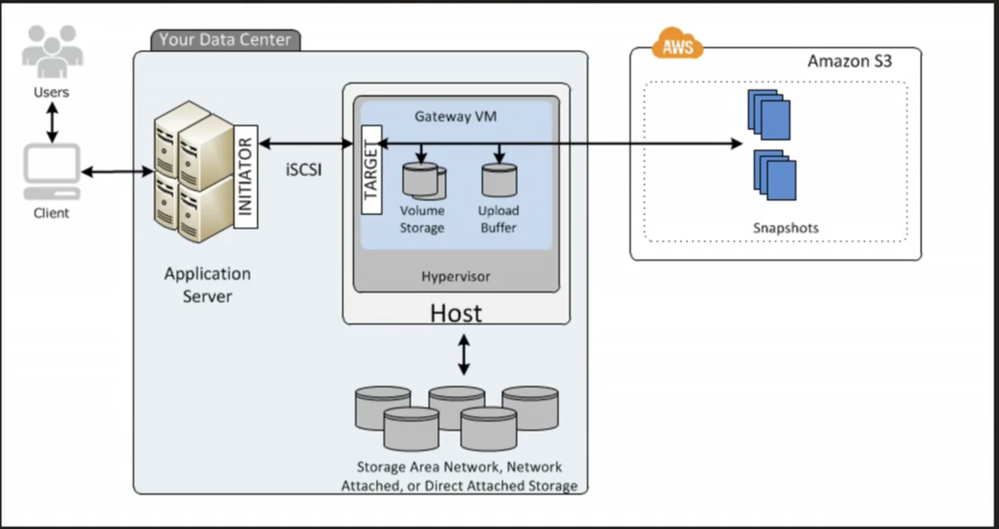

####  9.3.2. Volume Gateway - Cached Volumes ####
Cached volumes let you use S3 as your primary data storage while retaining frequently accessed data locally in your storage gateway. Cached volumes minimize the need to scale your on-premises storage infrastructure, while still providing your applications with low-latency access to their frequently accessed data. You can create storage volumes up to 32 TiB in size and attach to them as iSCSI devices from your on-premises application servers. Your gateway stores data that your write to these volumes in S3 and retains recently read data in your on-premises storage gateway's cache and upload buffer storage. 1GB - 32TB in size for Cached Volumes.

> Layman Terms: Your only keeping the most recently read data on premise, the rest is cached.

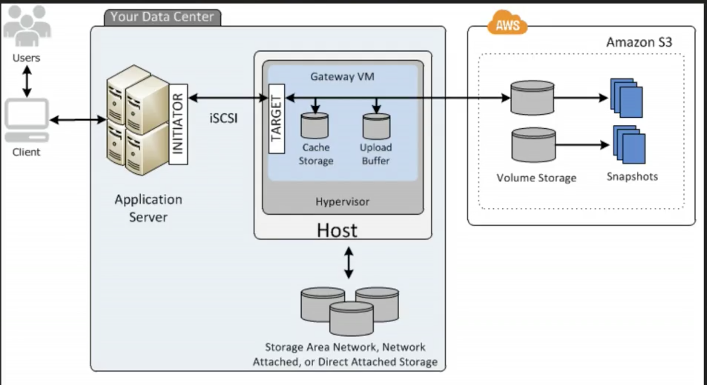

####  9.3.3. Volume Gateway - Tape Gateway ####
Tape Gateway offers a durable, cost-effective solution to archive your data in the AWS Cloud. The VTL interface it provides lets you leverage your existing tape-based backup application infrastructure to store data on virtual tape cartridges that you create on your tape gateway. Each tapegateway is preconfigured with a media changer and tape drives, which are available to your existing client backup applications as iSCSI devices. You add tape cartridges as you need to archive your data. Supported by NetBackup, Backup Exec, VEAM etc.

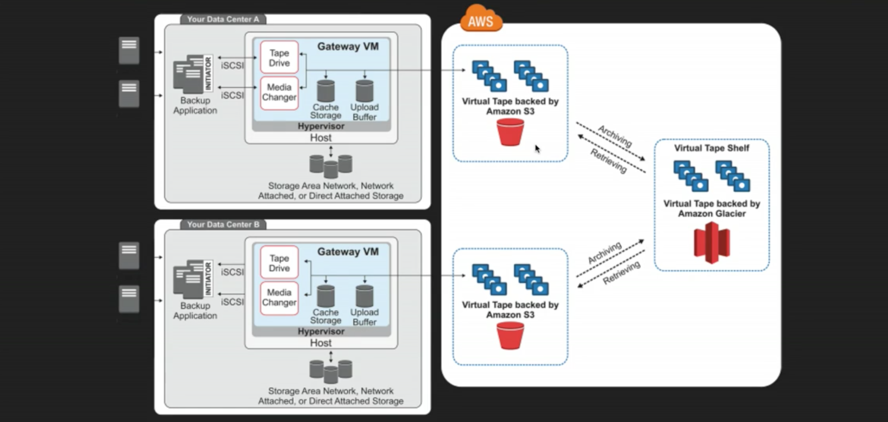

> Exam Tips:
>* File Gateway - For flat files, stored directly on S3.
>    * Stored Volumes - Entire Dataset is stored on site and is asynchronously backed up to S3.
>   * Cached Volumes - Entire Dataset is stored on S3 and the most frequently accessed data is cached on site.
>* Gateway Virtual Tape Library (VTL)
>   * Used for backup and uses popular backup applications like NetBackup, Backup Exec, Veam etc.

##  10. L54 - Snowball
Import/Export Disk (before Snowball)
AWS Import/Export Disk accelerates moving large amounts of data into and out of the AWS cloud using portable storage devices for transport. AWS Import/Export Disk transfers your data directly onto and off of storage devices using Amazon's high-speed internal network and bypassing the Internet.

###  10.1. Types of Snowballs ###
* Snowball
* Snowball Edge
* Snowmobile

####  10.1.1. Snowball ####
Snowball is petabyte-scale data transport solution that uses secure appliances to transfer large amounts of data into and out of AWS. Using Snowball addresses common challenged with large-scale data transfers including high network costs, long transfer times and security concerns. Transferring data with Snowball is simple, fast, secure and can be as little as one-fifth the cost of high-speed Internet.

80TB snowball in all regions. Snowball uses multiple layers of security designed to protect your data including tamper-resistant enclosures, 256-bit encryption, and an industry-standard Trusted Platform Module (TPM) designed to ensure both security and full chain-of-custody of your data. Once the data transfer job has been processed and verified, AWS performs a software erasure of the Snowball appliance.

> Layman Terms: A way to quickly transfer large amounts of data into and out of AWS.

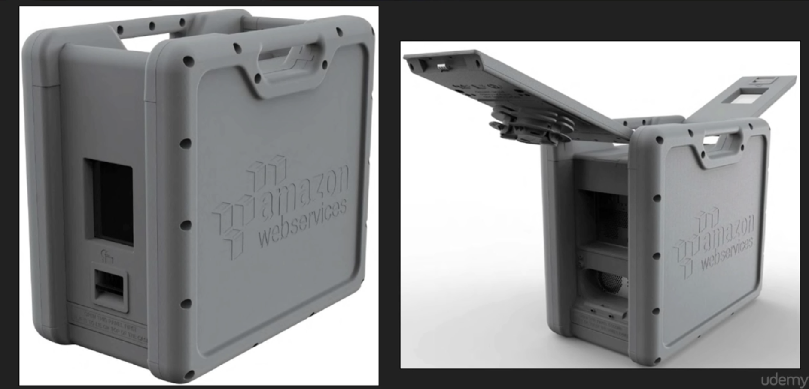

####  10.1.2. Snowball Edge ####
> Layman Terms: AWS Snowball Edge contains 100TB of data and comes with on board storage and compute capacity. You can run Lambda functions from it.

You can use Snowball Edge to move large amounts of data into and out of AWS, as a temporary storage tier for large local datasets, or to support local workloads in remote or offline locations.

Snowball Edge connects to your existing applications and infrastructure using standard storage interfaces, streamlining the data transfer process and minimizing setup and integration. Snowball Edge can cluster together to form a local storage tier and process your data on-premises, helping ensure your applications continue to run even when hey are not able to access the cloud.

####  10.1.3. Snowmobile ####
AWS Snowmobile is an Exabyte-scale data transfer service used to move extremely large amounts of data to AWS. You can transfer up to 100PB per Snowmobile, a 45-foot long ruggedised shipping container, pulled by a semi-trailer truck. Snowmobile makes it easy to move massive volumes of data to the cloud, including video libraries, image repositories, or even a complete data center migration. Transferring data with Snowmobile is secure, fast and cost effective.

Exabyte should take roughly 6 months to transfer.

> Layman Terms: Really big truck to move data. Would probably only see this in a Fortune 500 company.

####  10.1.4. Exam Tips ####
* Understand what a Snowball is
* Understand what Import Export is
* Understand what Snowball can do:
    * Import to S3
    * Export from S3

##  11. L55 - S3 Transfer Acceleration
S3 Transfer Acceleration utilizes the CloudFront Edge Network to accelerate your uploads to S3. Instead of uploading directly to your S3 bucket, you can use a distinct URL to upload directly to an edge location which will then transfer that file to S3. You will get a distinct URL to upload to;
e.g. acloudguru.s3-accelerate.amazonaws.com

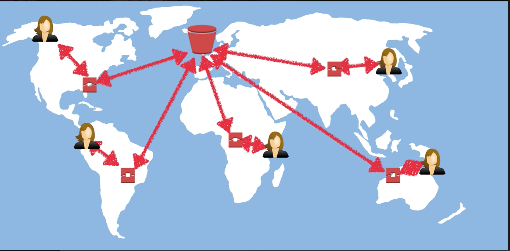

There is an ability to compare the speeds across different regions across the globe.

> The further away the region is where you are trying to push the data, the more improvement there is from S3 Transfer Acceleration.

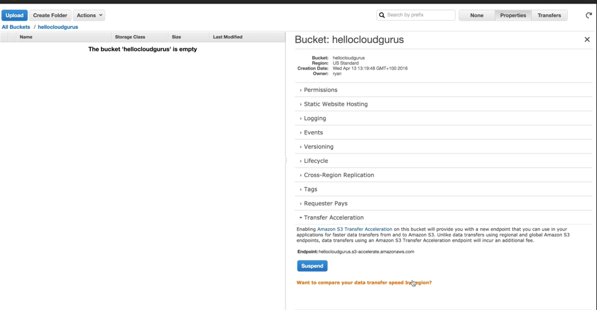

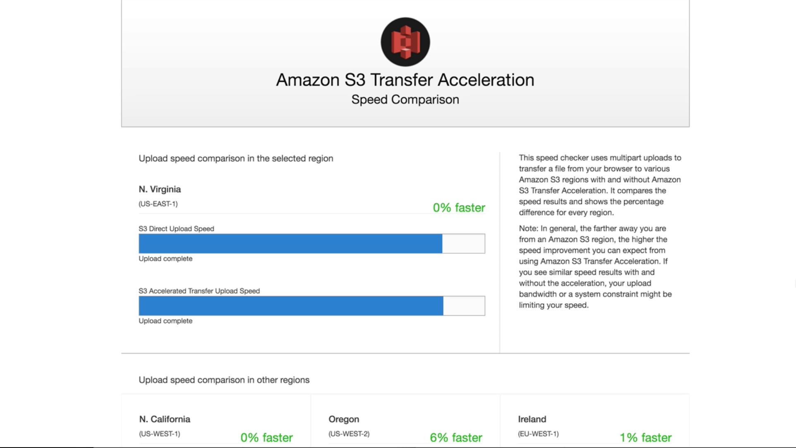

##  12. L56 - S3 Summary
###  12.1. S3 - Exam Tips for S3 101 ###
* Remember that S3 is Object based i.e. allows your to upload files.
* Files can be from 0 Bytes to 5TB
* There is unlimited storage
* Files are stored in Buckets
* S3 is a unviersal namespace, that is, names must be unique globally (and lowercase).
* https://s3-eu-west-1.amazon.com/acloudguru
* Read after Write consistency for PUTS of new Objects
* Eventual Consistency for overwrite PUTS and DELETES (can take some time to propagate)
* S3 Storage Classes/Tiers
    * S3 (durable, immediately available, frequently accessed)
    * S3 - IA (durable, immediately available, infrequently accessed)
    * S3 - Reduced Redundancy Storage (data that is easily reproducible, such as thumb nails etc).
    * Glacier - Archived data, where you can wait 3-5 hours before accessing.
* Remember the core fundamentals of S3;
    * Key (name)
    * Value (data)
    * Version ID
    * Metadata
    * Access Control Lists
* Object based storage only (for files)
* Not suitable to install an operating system on.

###  12.2. S3 - Versioning ###
* Stores all version of an object (including all writes and even if you delete an object)
    * NB. If you have a 1GB object and you update it 10 times, you will pay for 10GB of storage.
* Great backup tool
* Once enabled, Versioning cannot be disabled, only suspended.
* Integrates with Lifecycle rules
* Versioning's MFA (Multifactor Authentication) Delete capability, which uses multi-factor authentication can be used to provide an additional layer of security.
* Cross Region Replication, requries versioning enabled on the source bucket and destination bucket.

###  12.3. S3 - Lifecycle Management ###
* Can be used in conjunction with versioning
* Can be applied to current versions and previous versions
* Following actions can now be done;
    * Transition to the Standard - Infrequent Access Storage Class (128KB and 30 days after the creation date)
    * Archive to the Glacier Storage Class (30 days after IA, if relevant)
    * Permanently Delete

###  12.4. CloudFront - Exam Tips ###
* Edge Location - This is the location where content will be cached. This is separate to an AWS Region/AZ
* Origin - This is the origin of all the files that the CDN will distribute. This can be either an S3 Bucket, an EC2 instance, and Elastic Load Balancer or Route53.
* Distribution - This is the name given the CSVN which consists of a collection of Edge Locations.
    * Web Distribution - Typically used for Websites.
    * RTMP - Used for Media Streaming
* Edge locations are not just READ only, you can write to them too (i.e. put an object on to them)
* Objects are cached for the life of the TTL (Time to Live) (default is 24hr).
* You can clear cached objects, but you will be charged

###  12.5. Securing your buckets ###
* By default, all newly created buckets are PRIVATE
* You can setup access control to your buckets using;
    * Bucket Policies
    * Access Control Lists
* S3 buckets can be configured to create access logs which log all requests made to the S3 bucket. This can be done to another bucket.

###  12.6. Encryption ###
* In Transit;
    * SSL/TLS
* At Rest
    * Server Side Encryption
        * S3 Managed Keys - SSE-S3
        * AWS Management Service, Managed KEys - SSE-KMS
        * Server Side Encryption with Customer Provided Keys - SSE-C
* Client Side Encryption

###  12.7. Storage Gateway ###
* File Gateway - For flat files, stored directly on S3.
* Volume Gateway
    * Stored Volumes - Entire Dataset is stored on site and is asynchronously backed up to S3.
    * Cached Volumes - Entire dataset is stored on S3 and the most frequently accessed data is cached on site.
* Gateway Virtual Tape Library (VTL)
    * Used for backup and uses popular backup applications like NetBackup, Backup Exec, Veam etc.

###  12.8. Snowball ###
* Snowball
    * Pure storage
    * Don't need to know how much storage is involved
* Snowball Edge
    * Can run Lambda functions from here.
    * Mini AWS data center in a box.
* Snowmobile
    * 100 PB of storage. Big truck!

* Understand what Snowball is
* Understand what Import Export is
* Snowball Can
    * Import to S3
    * Export to S3

###  12.9. S3 Transfer Acceleration ###
* You can speed up transfers to S3 using S3 transfer acceleration. This costs extra, and has the greatest impact on people who are in far away location.

###  12.10. S3 Static Websites ###
* You can use S3 to host static websites
* Serverless
* Very cheap, scales automatically
* STATIC only, cannot host dynamic sites.

###  12.11. CORS ###
* Cross Origin Resource Sharing
* Need to enable it on the resources bucket and state the URL for the origin that will be calling the bucket
* http://mybucketname.s3-website.eu-west-2.amazonaws.com (s3 website link)
* VS.
* https://s3.eu-west-2.amazonaws.com/mybucketname (s3 bucket link)

###  12.12. Last Few Tips ###
* Write to S3 - HTTP 200 code for successful write.
* You can load files to S3 much faster by enabling multipart upload.
* Read the S3 FAQ before taking the exam. It comes up A LOT!

##  13. QUIZ
Questions:

8. What is the largest size file you can transfer to S3 using a PUT operation? 5GB
9. If you want to enable a user to download your private data directly from S3, you can insert a pre-signed URL into a web page before giving it to your user. True
10. When you first create an S3 bucket, this bucket is publicly accessible by default. False

# Section 6: Databases Overview & Concepts

##  14. L57 Database Essentials

What is a relational database?
* Each field contains the same type.

Relational Database Types:
* SQL Server
* Oracle
* MYSQL Server
* PostgreSQL
* Aurorar
* MariaDB

###  14.1. Non Relational Databases ###
* Database
    * Collection (=Table)
    * Document (=Row)
    * Key Value Pairs (=Fields)

> JSON/NoSQL: {"_id": "123", "firstname": "John"}

###  14.2. What is Data Warehousing? ###
Used for business intelligence. Tools like Cognos, Japersoft, SQL Server Reporting Services, Oracle Hyperion, SAP NetWeaver.

Used to pull in very large and complex data sets. Usually used by management to do queries on data (such as current performance vs targets etc).

###  14.3. OLTP vs OLAP ###
Online Transaction Processing (OLTP) differs from OLAP Online Analytics Processing (OLAP) in terms of the types of queries run.

####  14.3.1. OLTP Example: ####
Order number 2120121
Pulls up a row of data such as Name, Date, Address to Deliver to, Delivery Status etc.

####  14.3.2. OLAP transcation Example: ####
Net Prodit for EMEA and Pacific for the Digitial Radio Product.
Pulls in large numbers of records

* Sum of Radios Sold in EMEA
* Sum of Radios Sold in Pacific
* Unit Cost of Radio in each region
* Sales price of each radio
* Sales price - unit cost

Data Warehousing databases use different type of architecture both from a database perspective and infrastructure layer.

###  14.4. What is Elasticache? ###
ElastiCache is a web service that makes it easy to deploy, operate, and scale an in-memory cache in the cloud. The service improves the performance of web applications by allowing you to retrieve information from fast, managed, in-memory caches, instead of relying entirely on slower disk-based databases. ElastiCache supports two open-source in-memory caching engines:

* Memcached
* Redis

###  14.5. What is DMS? ###
Announced at re:Invent 2015, DMS stands for Database Migration Service. Allows you to migrate your production database to AWS. Once the migration has started, AWS manages all the complexities of the migration process like data type transformation, compression, and parallel transfer (for faster data transfer) while ensuring that data changes to the source database that occur during the migration process are automatically replicated to the target.

AWS schema conversion tool automatically converts the source database schema and a majority of the custom code, including views, stored procedures, and functions, to a format compatible with the target database. 

###  14.6. AWS Database Types - Summary ###

* RDS - OLTP
    * SQL
    * MySQL
    * PostgreSQL
    * Oracle
    * Aurora
    * MariaDB
* DynamoDB - No SQL
* RedShift - OLAP
* Elasticache - In Memory Caching.
    * Memcahced
    * Redis
* DMS

# Section 7: DynamoDB

##  15. L58 Introduction to DynamoDB 
Very important for Developers Course. Read the FAQ's.

###  15.1. What is DynamoDB? ###
Amazon DynamoDB is fast and flexible NoSQL database service for all applications that need consistent, single-digit millisecond latency at any scale. It is fully managed database and supports both document and key-value data models. Its flexible data model and reliable performance make it a great fit for mobile, web, gaming, ad-tech, IoT, and many other applications.
Very popular apart from Redis.

####  15.1.1. Quick facts about DynamoDB ####
* Stored on SSD storage
* Spread Across 3 geographically distinct data centers (not Availability Zones)

* Eventual Consistent Reads (Default)
    * Consistency across all copies of data is usually reached within a second. Repeating a read after a short time should return the updated data. (Best Read Performance.)
* Strongly Consistent Reads
    * A strongly consistent read returns a result that reflects all writes that received a successful response prior to the read.

So, if the data can wait up to 1 second, use Eventual Consistent Reads, otherwise use Strongly Consistent Reads. You won't get the same performance from a SCR as opposed to ECR.

####  15.1.2. The Basics ####
* Tables
* Items (Think a row of data in table)
* Attributes (Think of a column of data in a table)

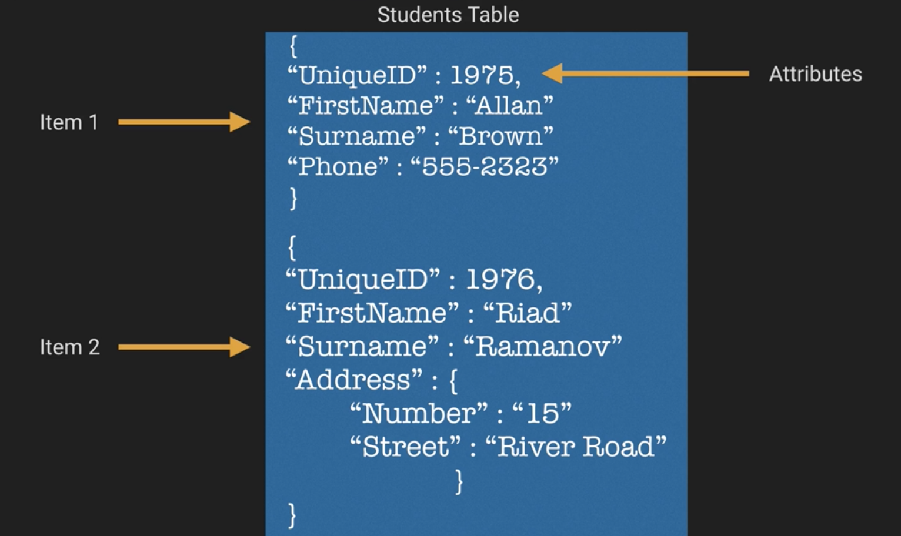

####  15.1.3. Pricing ####
* Provisioned Throughput Capacity
    * Write Throughput $0.0065 per hour for every 10 units
    * Read Throughput $0.0065 per hour for every 50 units
* First 25 GB stored per month is free
* Storage costs of $0.25 GB per month there after.

####  15.1.4. Pricing Example ####
Let's assume that your application needs to perform 1 million writes and 1 million reads per day, while storing 28 GB of data. First, you need to calculate how many writes and reads per second you need. 1 million evenly spread writes per day is equivalent to 1, 000, 000 (writes) / 24 (hours) / 60 (minutes) / 60 (seconds) = 11.6 writes per second.

A DynamoDB Write Capacity Unit can handle 1 write per second, so you need 12 Write Capacity Units. For write throughput, you are charged on $0.0065 for every 10 units.

So ($0.0065/10) * 12 * 24 = $0.1872 per day.

Similarly, to handle 1 million strongly consistent reads per day, you ned 12 Read Capacity Units. For read throughput you are charged $0.0065 for every 50 units.

So ($0.0065/50) * 12 * 24 = $0.0374 per day.

Storage costs is $0.25 per GB per month. Lets assume our database is 28GB. We get the first 25GB for free so we only pay for 3GB of storage which is $0.75 per month.

Total Cost = $0.1872 per day + $0.0374 per day Plus Storage of 0.75 per month

(30 * ($0.1872 + $0.0374)) * $0.75 = $7.488

With Free Tier You Get
25 Read Capacity Units
25 Write Capacity Units

####  15.1.5. Easiest Way to Learn DynamoDB ####
* Let's start our first Lab!

##  16. L59 Creating a DynamoDB Table

* Create a role in IAM to give full access to DynamoDB
* Assign role to an EC2 instance.
* Go into EC2 instance and launch it with that role
* Launch boostrap script which will setup our environment
* Ssh in that environment and install php
* Create some DynamoDb tables and insert data.

##  17. L60 DynamoDB Indexes & Streams

###  17.1. DynamoDB - Primary Keys ###
Two Types of Primary Keys Available;
* Single Attribute (think unique ID)
    * Partition Key (Hash Key) composed of one attribute
    * No nested data, one attribute only
* Composite (think unique ID and a date range)
    * Partition key & Sort key (Hash & Range) composed of two attributes.

* Partition Key
    * DynamoDB uses the partition key's value as input to an internal hash function. The output from the hash function determines the partition (this is simply the physical location in which the data is stored).
    * No two items in a table can have the same partition key value!

* Partition Key and Sort key
    * DynamoDB uses the partition key's value as input to an internal hash function. The output from the hash function determines the partition (this is simply the physical location in which the data is stored).
    * Two items can have the same partition key, but they must have a different sort key.
    * All items with the same partition key are stored together, in sorted order by sort key value.

###  17.2. DynamoDB - Indexes ###

####  17.2.1. Local Secondary Index ####
* Has the SAME Partition key, different sort key.
* Can ONLY be created when creating a table. They cannot be removed or modified later.

####  17.2.2. Global Secondary Index ####
* Has DIFFERENT Partition key, different sort key.
* Can be created at table creation or added LATER.

####  17.2.3. DynamoDB Streams ####
Used to capture any kind of modification of the DynamoDB tables.
* If a new item is added to the table, the stream captures an image of the entire item, including all of its attributes.
* If an item is updated, the stream captures the "before" and "after" image of any attributes that were modified in the item.
* If an item is deleted from the table, the stream captures an image of the entire item before it was deleted.

Example:

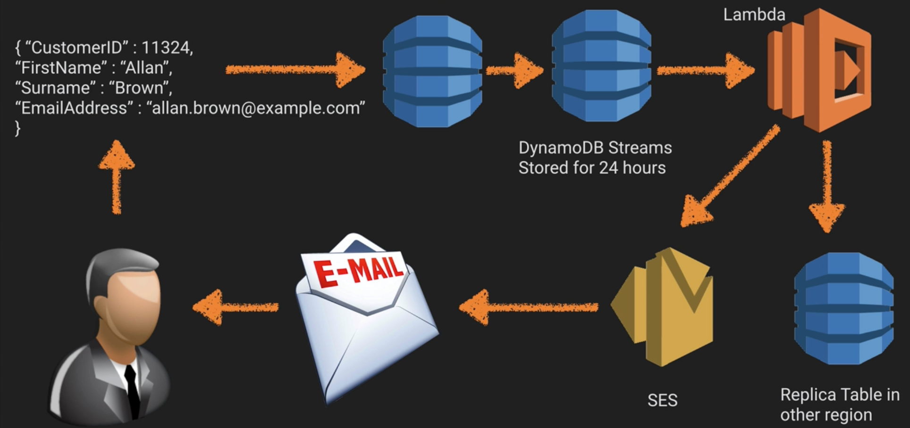

> NB.
> * You can export DynamoDB data to a csv from the console.
> * Push button scalability. You can limit the number of reads and writes to the database with one button and still have the database available. Unlike RDS which you will have some downtime.

##  18. L61 Scan vs. Query API Calls

###  18.1. What is a Query ###
* A Query operation finds items in a table using only primary key attribute values. You must provide a partition attribute name and a distinct value to search for.
* You can optionally provide a sort key attribute name and value, and use a comparison operator to refine the search results.
* By default, a Query returns all of the data attributes for items with the specified primary key(s); however, you can use the **ProjectionExpression** parameter so that the Query only returns some of the attributes, rather than all of them.
* Query results are always sorted by the sort key (if you have one). If the data type of the sort key is a number, the results are returned in numeric order; otherwise, the results are returned in order of ASCII character code values. By default, the sort order is ascending. To reverse the order, set the **ScanIndexForward** parameter to false.
* By Default is eventually consistent but can be changed to be strongly consistent.

###  18.2. What is Scan? ###
* A Scan operation examines every item in the table. By default, a Scan results all of the data attributes for every item; however, you can use the **ProjectionExpression** parameter so that the Scan only returns some of the attributes, rather than all of them.

###  18.3. What should I use? Query vs. Scan? ###
* Generally, a Query operation is more efficient than a Scan operation.
* A Scan operation always scans the entire table, then filters out values to provide the desired result, essentially adding the extra step of removing data from the result set. Avoid using a Scan operation on a large tale with a filter that removes many results, if possible. Also, as a table grows, the Scan operation slows. The Scan operation examines every time for the requested values, and can use up the provisioned throughput for a large table in a single operation.
* For a quicker response times, design your tables in a way that you can use the Query, Get or BatchGetItem APIs instead. Alternatively, design your application to use Scan operations in a way that minimizes the impact on your table's request rate.

####  18.3.1. Query & Scans Exam Tips ####
* A Query operation finds items in a table using only primary key attribute values. You must provide a partition key attribute name and a distinct value to search for.
* A Scan operation examines every item in the table. By default, a Scan returns all of the data attributes for every item; however you can use the **ProjectionExpression** parameter so that the Scan only returns some of the attributes, rather than all of them.
* Query results are always sorted by the sort key in ascending order. Set **ScanIndexForward** parameter to false to reverse it.
* Try to use a query operation over a Scan operation.

##  19. L62 DynamoDB & Provisioned Throughput
Definitely going to come up in the exam via a scenario.

###  19.1. Provisioned Throughput
* Unit of Read provisioned throughput
    * All reads are rounded up to increments of 4 KB
    * Eventual Consistent Reads (default) consist of 2 reads per second
    * Strongly Consistent Reads consist of 1 read per second.
* Unit of Write provisioned throughput
    * All writes are 1 KB
    * All writes consist of 1 write per second

####  19.1.1. The Magic Formula
Question - You have an application that requires to read 10 items of 1KB per second using eventual consistency. What should you set the read throughout to?
(Size of Read rounded to nearest 4KB chunk / 4 KB) * number of items = read throughput
Divide by 2 if eventually consistent.

Solution:
* First we calculate how many read units per item we need

* 1KB rounded to the nearest 4KB increment = 4.
* 4KB / 4KB = 1 read unit per item

* 1 x 10 read items = 10
* Using eventual consistency we get 10 / 2 = 5
* 5 units of read throughput

>Example 2:  You have an application that requires to read 10 items of 6KB per second using eventual consistency. What should you set the read throughout to?
> Solution:
>* First we calculate how many read units per item we need
>
>* 6KB rounded to the nearest 4KB increment = 8.
>* 8KB / 4KB = 2 read units per item
>
>* 2 x 10 read items = 20
>* Using eventual consistency we get 20 / 2 = 10
>* 10 units of read throughput

>Example 3:  You have an application that requires to read 5 items of 10KB per second using eventual consistency. What should you set the read throughout to?
> Solution:
>* First we calculate how many read units per item we need
>
>* 10KB rounded to the nearest 4KB increment = 12.
>* 12KB / 4KB = 3 read units per item
>
>* 3 x 5 read items = 15
>* Using eventual consistency we get 15 / 2 = 7.5
>* 7.5 units of read throughput
>* But can we use 7.5? No! We have to round up to 8.

###  19.2. Error Codes ###
**400 HTTP Status Code - ProvisionedThroughputExceededException**

You exceeded your maximum allowed provisioned throughput for a table or for one or more global secondary indexes.

##  20. L63 Using Web Identity Providers To Connect To Authenticate To DynamoDB

###  20.1. Web Identity Providers
You can authenticate users using Web Identity providers (such as Facebook, Google, Amazon or any other Open-ID Connect-compatible Identity provider). This is done using AssumeRoleWithWebIdentity API.

You will need to create a role first.
ARN - Amazon Resource Name

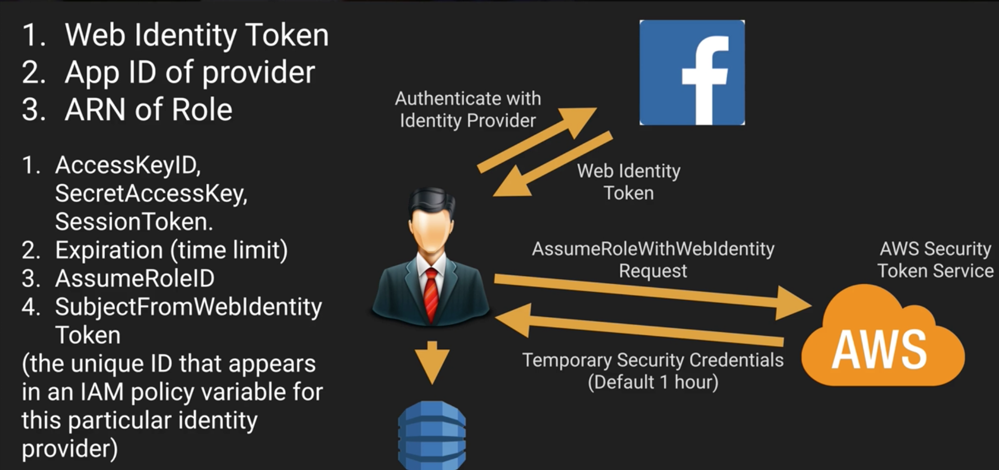

> NB. Don't need to know every step in the process.
> What you do need to know is the following:
> Steps taken to authenticate
> 1. User Athenticates with ID provider (such as Facebook)
> 2. They are passed a Token by their ID provider.
> 3. Your code calls **AssumeRoleWithWebIdentity** API and provides the providers token and specifies the ARN for the IAM Role.
> 4. App can now access DynamoDB from between 15miutes to 1hour (default is 1 hour)

In the console:
1. Creata a new role
2. Create a new policy for that role
    1. Paste the policy which was copied from the DynamoDB authentication
3. Done!

##  21. L64 Other important aspects of DynamoDB

DynamoDB is spread across 3 separate facilities. Can cause some issues.
1. Reading the data from separate facilities.
2. Writing the data from different facilities.

The problem:
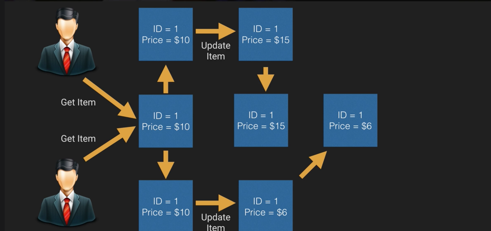

The solution:
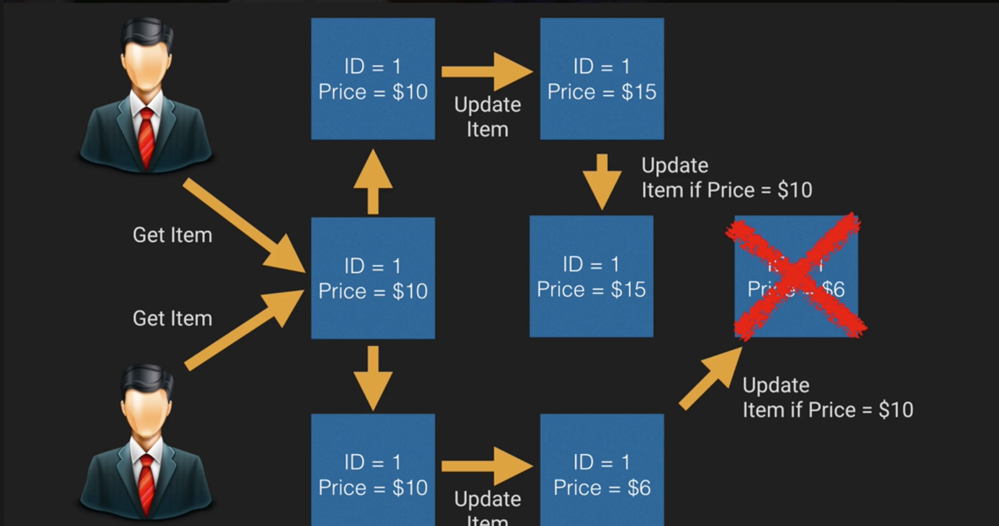

If item = $10 then update to $12.

Note that conditional writes are **idempotent**. This means that you can send the same conditonal write request multiple times, but it will have no further effect on the item after the first time DynamoDB performs the specified update. For example, suppose you issue a request to update the price of a book item by 10%, with the expectation that the price is currently $20. However, before you get a reponse, a network error occurs and you don't know whether your request was successful or not. Because a conditional update is an idempotent operation, you can send the same request again and DynamoDB will update the price only if the current price is still $20.

###  21.1. Atomic Counters

DynamoDB supports atomic counters, where you use the **UpdateItem** operation to increment or decrement the value of an existing attribute without interfering with other write requests. (All write requests are applied in the order in which they were received.) For example, a web application might want to maintain a counter per visitor to their site. In this case, the application would need to increment this counter regardless of its current value.

Atomic counter updates are idempotent. This means that the counter will increment each time you call UpdateItem. If you suspect that a previous request was unsuccessful, your application could retry the UpdateItem operation; however, this would risk updating the counter twice. This might be acceptable for a web site counter, because you can tolerate with slightly over-or under-counting the visitors. However, in a banking application, it would be safer to use a conditional update rather than an atomic counter.

###  21.2. Batch Operations
If your application needs to read multiple items, you can use the **BatchGetItem** API. A single **BatchGetItem** request can retrieve up to 1MB of data, which can contain as many as 100 items. In addition, a single **BatchGetItem** request can retrieve items from multiple tables.

##  22. L65 DynamoDB Summary
Most important topic in Certified Developers Associated Exam. 

###  22.1. What is DynamoDB?
Amazon DynamoDB is fast and flexible NoSQL database service for all applications that need consistent, single-digit millisecond latency at any scale. It is fully managed database and supports both document and key-value data models. Its flexible data model and reliable performance make it a great fit for mobile, web, gaming, ad-tech, IoT, and many other applications.
It is fully managed you cannot ssh into it.

###  22.2. Quick facts about DynamoDB
* Stored on SSD storage
* Spread Across 3 geographically distinct data centers (not Availability Zones)

* Eventual Consistent Reads (Default)
    * Consistency across all copies of data is usually reached within a second. Repeating a read after a short time should return the updated data. (Best Read Performance.)
* Strongly Consistent Reads
    * A strongly consistent read returns a result that reflects all writes that received a successful response prior to the read.

###  22.3. The Basics
* Tables
* Items (Think a row of data in table)
* Attributes (Think of a column of data in a table)

Two Types of Primary Keys Available;
* Single Attribute (think unique ID)
    * Partition Key (Hash Key) composed of one attribute
* Composite (think unique ID and a date range)
    * Partition key & Sort key (Hash & Range) composed of two attributes.

* Partition Key
    * DynamoDB uses the partition key's value as input to an internal hash function. The output from the hash function determines the partition (this is simply the physical location in which the data is stored).
    * No two items in a table can have the same partition key value!

* Partition Key and Sort key
    * DynamoDB uses the partition key's value as input to an internal hash function. The output from the hash function determines the partition (this is simply the physical location in which the data is stored).
    * Two items can have the same partition key, but they must have a different sort key.
    * All items with the same partition key are stored together, in sorted order by sort key value.

###  22.4. DynamoDB - Indexes ###

####  22.4.1. Local Secondary Index ####
* Has the SAME Partition key, different sort key.
* Can ONLY be created when creating a table. They cannot be removed or modified later.

####  22.4.2. Global Secondary Index ####
* Has DIFFERENT Partition key, different sort key.
* Can be created at table creation or added LATER.

####  22.4.3. DynamoDB Streams ####
Used to capture any kind of modification of the DynamoDB tables.
* If a new item is added to the table, the stream captures an image of the entire item, including all of its attributes.
* If an item is updated, the stream captures the "before" and "after" image of any attributes that were modified in the item.
* If an item is deleted from the table, the stream captures an image of the entire item before it was deleted.

Example:

####  22.4.4. Query & Scans Exam Tips ####
* A Query operation finds items in a table using only primary key attribute values. You must provide a partition key attribute name and a distinct value to search for.
* A Scan operation examines every item in the table. By default, a Scan returns all of the data attributes for every item; however you can use the **ProjectionExpression** parameter so that the Scan only returns some of the attributes, rather than all of them.
* Try to use a query operation over a Scan operation.

###  22.5. Review Example Calculations:
Question - You have an application that requires to read 10 items of 1KB per second using eventual consistency. What should you set the read throughout to?
(Size of Read rounded to nearest 4KB chunk / 4 KB) * number of items = read throughput
Divide by 2 if eventually consistent.

Solution:
* First we calculate how many read units per item we need

* 1KB rounded to the nearest 4KB increment = 4.
* 4KB / 4KB = 1 read unit per item

* 1 x 10 read items = 10
* Using eventual consistency we get 10 / 2 = 5
* 5 units of read throughput

###  22.6. Error Codes ###
**400 HTTP Status Code - ProvisionedThroughputExceededException**

You exceeded your maximum allowed provisioned throughput for a table or for one or more global secondary indexes.

###  22.7. Steps taken to authenticate

1. User Athenticates with ID provider (such as Facebook)
2. They are passed a Token by their ID provider.
3. Your code calls **AssumeRoleWithWebIdentity** API and provides the providers token and specifies the ARN for the IAM Role.
4. App can now access DynamoDB from between 15miutes to 1hour (default is 1 hour)

###  22.8. Conditional Writes.

If item = $10 then update to $12.

Note that conditional writes are **idempotent**. This means that you can send the same conditonal write request multiple times, but it will have no further effect on the item after the first time DynamoDB performs the specified update. For example, suppose you issue a request to update the price of a book item by 10%, with the expectation that the price is currently $20. However, before you get a reponse, a network error occurs and you don't know whether your request was successful or not. Because a conditional update is an idempotent operation, you can send the same request again and DynamoDB will update the price only if the current price is still $20.

###  22.9. Atomic Counters

DynamoDB supports atomic counters, where you use the **UpdateItem** operation to increment or decrement the value of an existing attribute without interfering with other write requests. (All write requests are applied in the order in which they were received.) For example, a web application might want to maintain a counter per visitor to their site. In this case, the application would need to increment this counter regardless of its current value.

Atomic counter updates are idempotent. This means that the counter will increment each time you call UpdateItem. If you suspect that a previous request was unsuccessful, your application could retry the UpdateItem operation; however, this would risk updating the counter twice. This might be acceptable for a web site counter, because you can tolerate with slightly over-or under-counting the visitors. However, in a banking application, it would be safer to use a conditional update rather than an atomic counter.

###  22.10. Batch Operations
If your application needs to read multiple items, you can use the **BatchGetItem** API. A sinlge **BatchGetItem** request can retrieve up to 1MB of data, which can contain as many as 100 items. In addition, a single **BatchGetItem** request can retrieve items from multiple tables.

###  22.11. READ THE DYNAMODB FAQ
**If you read one FAQ in preparing for this curse, make sure it's the DynamoDB FAQ!!**

##  23. Quiz
1. DynamoDB is a No-SQL database provided by AWS.
    * True
2. You have a motion sensor which writes 600 items of data every minute. Each item consists of 5kb. Your application uses eventually consistent reads. What should you set the read throughput to?
    * 10
3. A scan is more efficient than a query in terms of performance.
    * False
4. What does the error “ProvisionedThroughputExceededException” mean in DynamoDB?
    * You exceeded your maximum allowed provisioned throughput for a table or for one or more global secondary indexes.
5. You have a motion sensor which writes 600 items of data every minute. Each item consists of 5kb. What should you set the write throughput to?
    * 50
6. What is the API call to retrieve multiple items from a DynamoDB table?
    * BatchGetItem
7. You have a motion sensor which writes 600 items of data every minute. Each item consists of 5kb. Your application uses strongly consistent reads. What should you set the read throughput to?
    * 20
8. Using the AWS portal, you are trying to Scale DynamoDB past its preconfigured maximums. Which service can you increase by raising a ticket to AWS support?
    * Provisioned throughput limits
9. You have an application that needs to read 25 items of 13kb in size per second. Your application uses eventually consistent reads. What should you set the read throughput to?
    * 50
10. You have an application that needs to read 25 items of 13kb in size per second. Your application uses strongly consistent reads. What should you set the read throughput to?
    * 100

# Section 8: Simple Queue Service (SQS)

##  24. L66 What is SQS?
Maybe 3 or 4 questions on Exam

###  24.1. SQS
Amazon SQS is a web service that gives you access to a message queue that can be used to store messages while waiting for a computer to process them.

Amazon SQS is a distributed queue system that enables web service applications to quickly and reliably queue messages that one component in the application generates to be consumed by another component. A queue is a temporary respository for messages that are awaiting processing.

Using Amazon SQS, you can decouple the components of an application so they run independently, with Amazon SQS easing message management between components. Any component of a distributed application can store messages in a fail-safe queue.

Messages can contain up to 256KB of text in any format. Any component can later retrieve the messages programmatically using the Amazon SQS API.
> Exam Tip. Remember the fact the message max size is 256KB.

The queue acts as a buffer between the component producing and saving data, and the component receiving the data for processing.

This means the queue resolves issues that arise if the producer is producing work faster than the consumer can process it, or if the producer or consumer are only intermittently connected to the network.
e.g. autoscaling or fail over

Amazon SQS ensures delivery of each message at least once, and supports multiple readers and writers interacting with the same queue.

A single queue can be used simultaneously by many distributed application components, with no need for those components to coordinate with each other to share the queue.

Amazon SQS is engineered to always be available and deliver messages. One of the resulting tradeoffs is that SQS does not guarantee first in, first out delivery of messages. For many distributed applications, each message can stand on its town, and as long as all messages are delivered, the order is not important.

If your system requires that order by preserved, you can place sequencing information in each message, so that you can reorder the messages when the queue returns them.

To illustrate, suppose you have a number of image files to encode. In a Amazon SQS worker queue, you create an Amazon SQS message for each file specifying the command (jpeg-encode) and the location of the file in Amazon S3.

A pool of Amazon EC2 instances running the needed image processing software does the following:
1. Asynchronously **pulls** the task messages from the queue
2. Retrieves the named file
3. Processes the conversion
4. Writes the image back to Amazon S3.
5. Writes a "task complete" message to another queue.
6. Deletes the original task message
7. Checks for more messages in the worker queue

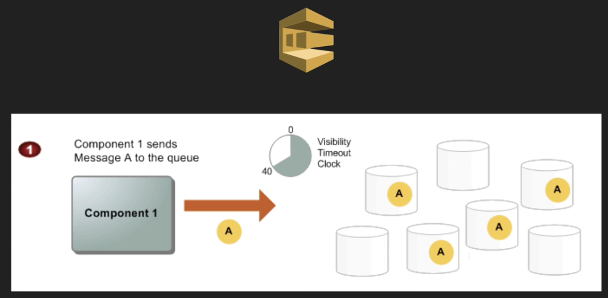

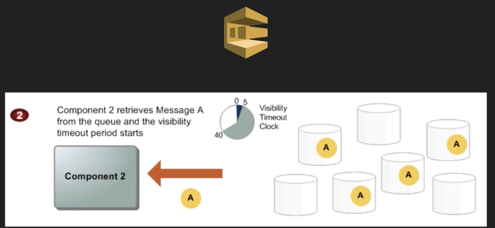

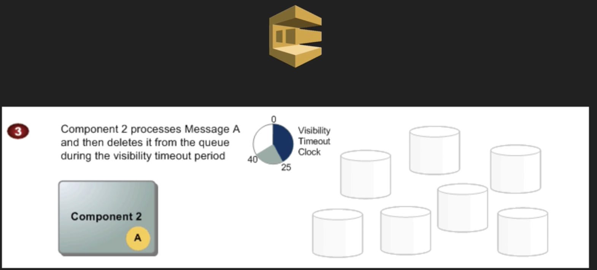

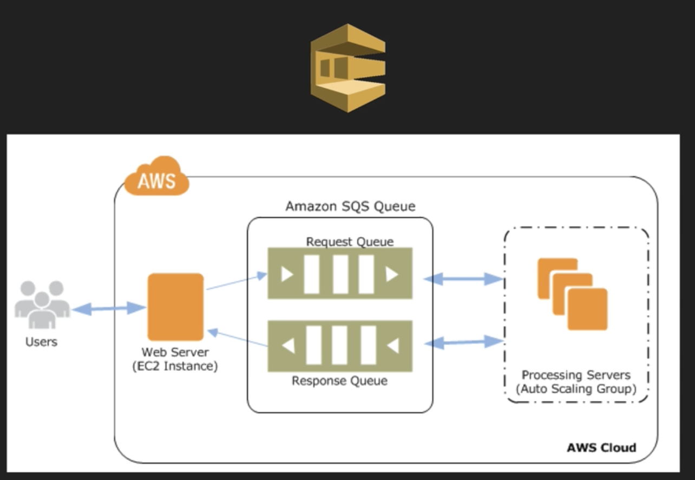

###  24.2. SQS Exam Tips
* Does not offer FIFO
* 12 hours visibility time out
* Amazon SQS is engineered to provide "at least once" delivery of all messages in its queues. Although most of the time each message will be delivered to your application exactly once, you should design your system so that processing a message more than once does not create any errors or inconsistencies.
* 256 KB message size now available
* Billed at 65KB "Chunks" (based on old message sizes)

###  24.3. SQS Pricing
* Firt 1 million Amazon SQS Requets per month are free
* $0.50 per 1 million Amazon SQS Requests per month thereafter ($0.00000050 per SQS Request)
* A single request can have from  to 10 messages, up to a maximum total payload of 256KB.
* Each 64KB 'chunk' of payload is billed as 1 request. For example, a single API call with a 256KB payload will be billed as four requests.

##  25. L67 SQS Developer Exam Tips
* SQS Messages can be delivered multiple times and in any order
* No FIFO
* Default visibility time out is 30 seconds
* Maximum Time out is 12 hours
When you receive a message from a queue and begin processing it, you may find the visibility timeout for the queue is insufficient to fully process and delete that message. To give yourself more time to process the message, you can extend its visibility timeout by using the **ChangeMessageVisibility** action to specify a new timeout value. Amazon SQS restarts the timeout period using the new value.

###  25.1. SQS Long Polling

SQS long polling is a way to retrieve messages from your SQS queues. While the traditional SQS short polling returns immediately, even if the queue being polled is empty, SQS long polling doesn't return a response until a message arrives in the queue, or the long poll times out. SQS long polling makes it easy and inexpensive to retrieve messages from your SQS queue as soon as they are available.

Maximum Long Poll Time Out = 20 seconds

Example Questions:
Polling in a tight loops is burning CPU cycles and costing the company money. How would you fix this?
Answer: Enable Long Polling

###  25.2. Fanning Out
Create an SNS topic first using sns. Then create and subscribe multiple SQS queues to the SNS topic.

Now whenever a message is sent to the SNS topic, the message will be fanned out to the SQS queues, i.e. SNS will deliver the message to all the SQS queues that are subscribed to the topic.

##  26. Quiz
1. SQS was the first service on the AWS platform?
    * True
2. How large can an SQS message be?
    * 256 KB
3. What is the default visibility time out setting?
    * 30 seconds
4. An SQS message can be delivered multiple times.
    * True
5. You are designing a new application which involves processing payments and delivering promotional emails to customers. You plan to use SQS to help facilitate this. You need to ensure that the payment process takes priority over the creation and delivery of emails. What is the best way to achieve this.
    * Use 2 SQS queues for the platform. Have the Ec2 fleet poll the payment SQS queue first. If the queue is empty, then poll the promotional emails queue.
6. Your EC2 instances download jobs from the SQS queue, however they are taking too long to process them. What API call can you use to extend the length of time to process the jobs?
    * ChangeMessageVisibility
7. What is the default visibility time out?
    * 30 seconds
8. You have a fleet of EC2 instances that are constantly polling empty SQS queues which is burning CPU compute cycles and costing your company money. What should you do?
    * Enable SQS Long Polling
9. What is the maximum long poll time out?
    * 20 seconds
10. What amazon service can you use in conjunction with SQS to "fan out" SQS messages to multiple queues.
    * SNS

# Section 9: Simple Notification Service (SNS)
Doesn't come up too much in the exam, just bits and pieces.
##  27. L68 Introduction to SNS

###  27.1. SNS
Amazon Simple Notification Service (Amazon SNS) is a web service that makes it easy to set up, operate, and send notifications from the cloud.

It provides developers with a highly scalable, flexible, and cost-effective capability to publish messages from an application and immediately deliver them to subscribers or other applications.

Amazon SNS follows the "publish-subscribe" (pub-sub) messaging paradign, with notifications being delivered to clients using a "push" mechanism that elimates the need to periodically check or "poll" for new information and updates.

With simple APIs requiring minimal up-front development effort, no maintenance or management overheard and pay-as-you-go pricing, Amazon SNS gives developers an easy mechanism to incorporate a powerful notification system with their applications.

Push notifications to Apple, Google, Fire OS, and Windows devices, as well as Android devics in China with Baidu Cloud Push.

Besides pushing cloud notifications directly to mobile devices, Amazon SNS can also deliver notifications by SMS text message or email, to Amazon SQS queues or to any HTTP endpoint.

To prevent messages from being lost, all messages published to Amazon SNS are stored redundantly across multiple availability zones.

###  27.2. SNS-Topics

SNS allows you to group multiple recipients using topics. A topic is an "access point" for allowing recipients to dynamically subscribe for identical copies of the same notification.

One topic can support deliveries to multiple endpoint types - for example, you can group together iOS, Android and SMS recipients. When you publish once to a topic, SNS delivers to appropriately formatted copies of your message to each subscriber.

###  27.3. SNS - Benefits

* Instantaneous, push-based delivery (no polling)
* Simple APIs and easy integration with applications
* Flexible message delivery over multiple transport protocols.
* Inexpensive, pay-as-you-go model with no up-front costs.
* Web-based AWS Management Console offers the simplicity of a point-and-click interface.

###  27.4. SNS vs. SQS
* Both Messaging Services in AWS
* SNS - Push
* SQS - Polls (pulls)
* Users pay $0.50 per 1 million SNS Requests
* $0.06 per 100, 000 Notification deliveries over HTTP
* $0.075 per 100 Notification deliveries over SMS
* $2.00 per 100,000 Notification deliveries over Email

##  28. L69 Creating an SNS Topic
Lab using the AWS Console
1. Create a Topic
2. Publish a topic
    * Can adjust the TTL here

##  29. L70 SNS Summary
* Instantaneous, push-based delivery (no polling)
* Protocols include;
    * HTTP
    * HTTPS
    * Email
    * Email-JSON
    * Amazong SQS
    * Application
* Messages can be customized for each protocol.

##  30. QUIZ
1. SNS is pull based rather than push based? 
    * False
2. Which of these is a protocol NOT supported by SNS;
    * FTP
3. Messages cannot be customised for each protocol used in SNS?
    * False
4. You have a list of subscribers email addresses that you need to push emails out to on a periodic basis. What do you subscribe them to?
    * A Topic
5. You can use SNS in conjunction with SQS to fan a single message out to multiple SQS queues.
    * True

# Section 10: Simple Workflow Service (SWF)
Example Tips: Comparing to SQS

Amazon Simple Workflow Service (Amazon SWF) is a web service that makes it easy to coordinate work across distributed application components. Amazon SWF enables applications for a range of use cases, including media processing, web application back-ends, business process workflows, and analytics pipelines, to be designed as a coordination of tasks.

Tasks represent invocations of various processing steps in an application which can be performed by executable code, web service calls, human actions and scripts.

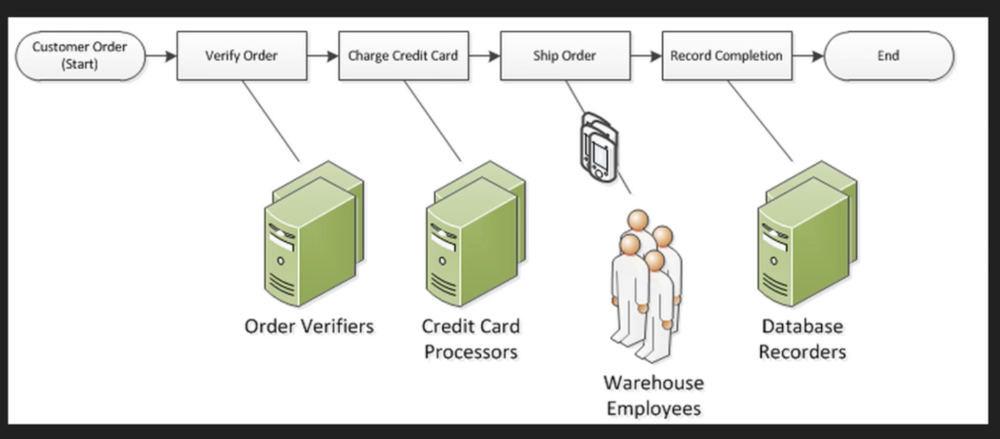

###  30.1. SWF Workers
Workers are programs that interact with Amazon SWF to get tasks, process received tasks, and return the results

###  30.2. SWF Decider
The decider is a program that controls the coordination of tasks i.e their ordering, concurrency and scheduling according to the application logic.

###  30.3. SWF Workers & Deciders
The workers and the decider can run on cloud infrastructure, such as Amazon EC2, or on machines behind firewalls. Amazon SWF brokers the interactions between workers and the decider. It allows the decider to get consistent views into the progress of tasks and to initiate new taks in an ongoing manner.

At the same time, Amazon SWF stores tasks, assigns them to workers when they are ready, and monitors their progress. It ensures that a task is assigned only once and is never duplicated. Since Amazon SWF maintains the application's state durably, workers, and deciders don't have to keep track of execution state. They can run independently, and scale quickly.

> NB. SWF a task is only assigned once and never duplicated.
>
> SQS a task can be done more than once and duplicated.

###  30.4. SWF Domains
Your workflow and activity types and the workflow execution itself are all scoped to a domain. Domains isolate a set of types, executions, and task lists from others within the same account.

You can register a domain by using the AWS Management Console or by using the RegisterDomain action in the Amazon SWF API.

The parameters are specified in JSON format.
> https://swf.us-1-east.amazonaws.com
>
> Register Domain
>
>{
>
>"name": "8123124"
>
>"description" : "music"
>
> "workflorwExecutionRetentionPeriodInDays": "60
>
>}

> Exam Question:
Maximum Workflow can be 1 year and the value is always measured in seconds.

###  30.5. SWF vs. SQS
* Amazon SWF presents a task-oriented API, whereas Amazon SQS offers a message-oriented API.
* Amazon SWF ensures that a task is assigned only once and is never duplicated. With Amazon SQS, you need to handle duplicated messages and may also need to ensure that a message is processed only once.
* Amazon SWF keeps track of all the tasks and events in an application. With Amazon SQS you need to implement your own application-level tracking, especially if your application uses multiple queues.

##  31. QUIZ
1. SWF consists of a domain, workers and deciders?
    * True.
2. Maintaining your application’s execution state (e.g. which steps have completed, which ones are running, etc.) is a perfect use case for SWF.
    * True
3. Amazon SWF is useful for automating workflows that include long-running human tasks (e.g. approvals, reviews, investigations, etc.) Amazon SWF reliably tracks the status of processing steps that run up to several days or months.
    * True
4. In Amazon SWF what is a worker?
    * Workers are programs that interact with Amazon SWF to get tasks, process recieved tasks, and return results.
5. In Amazon SWF what is a decider.
    * The decider is a program that controls the coordination of tasks, i.e. their ordering, concurrency and scheduling according to the application logic.

# Section 11: CloudFormation

* Deploy CloudFormations in Stacks, or as an existing template.
* A lot of sample templates available when creating a stack

###  31.1. First Note:
Question 1:
* The software from CloudFormation, ElasticBeanStalk and autoscaling is free.
* The resources they use is not free.

Question 2:
> Exam Question:
> 
> Identitfy a CloudFormation template:
> JSON type
> * Parameters {keyname: {description, type, constraint description}, dname {default, description}

Question 3:
In JSON section it has "Outputs". You can output the DNS Name of Load Balancer after creating. Don't have to manually go in a check it.
Want to know the public IP address, S3 bucket etc.
Can get this using the **"Fn: GetAtt"**

Question 4:
* Rollback is enabled by default so you don't have to worry about it.

##  32. QUIZ
1. The default scripting language for CloudFormation is
    * JSON
2. Cloud Formation itself is free, however the resources it provisions will be charged at the usual rates.
    * True
3. What happens if Cloud Formation encounters an error by default?
    * It will terminate and rollback resources created on failure.
4. You are creating a virtual data centre using cloud formation and you need to output the DNS name of your load balancer. What command would you use to achieve this?
    * FN::GetAtt
5. What language are cloud formation templates written in?
    * JSON

# Section 12: Elastic Beanstalk

* Create new Elastic Beanstalk environment
* What can it come preconfigured with?
    * IIS
    * Node.js
    * PHP
    * Python
    * Ruby
    * TomCat
* Can upload as a file.
* Can set the deployment limits
* Need a unique environment URL
* Application health check URL, shows you if the application is available.
* Can add AWS access keys in the configuration to be used for S3 for example.

> Exam Tips:
>1. Lanaguages that are supported (listed above).
>2. Do you pay for Elastic Beanstalk? No, but for resources.

##  33. QUIZ
1. Elastic Beanstalk is object based storage.
    * False
2. What languages and development stacks is NOT supported by AWS Elastic Beanstalk?
    * Jetty for Jbos applications
3. Unlike Cloud Formation, Elastic Beanstalk itself is not free free AND you must also pay for the resources it provisions.
    * False

# Section 13: AWS Shared Responsbility
Good to have high level understanding

Shared Responsibility Model for Infrastructure Services
EC2 infrastructure as a service. 
Hypervisor
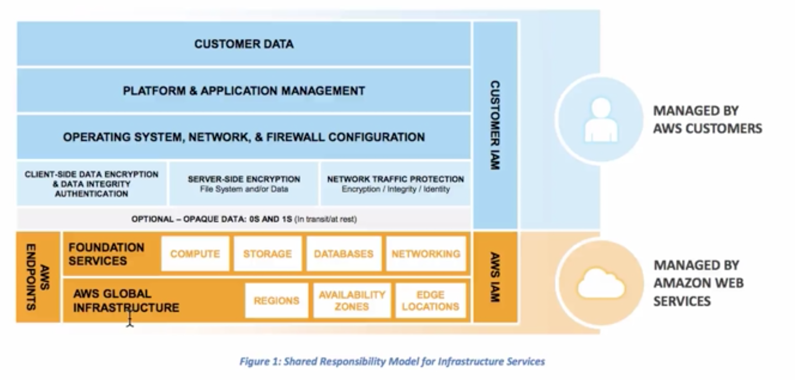

Shared Responsibility Model for Container Services
up to operating system and application services for patching
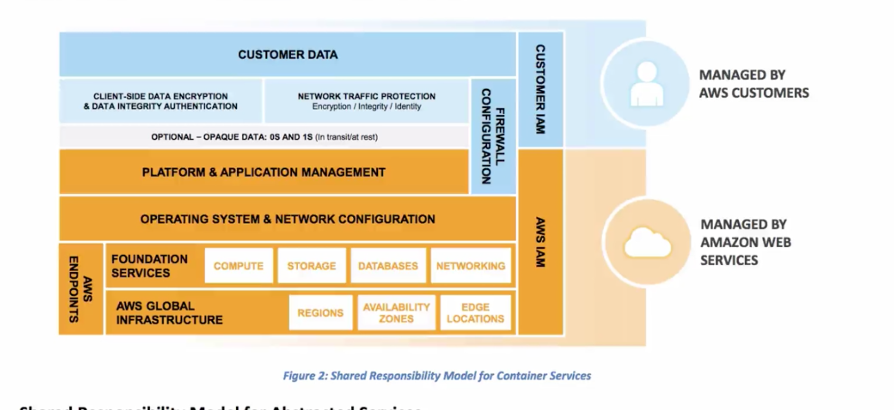

Shared Responsibility Model for Abstracted Services
S3 or DynamoDB or Lambda
Everything except customer data and client side encryption
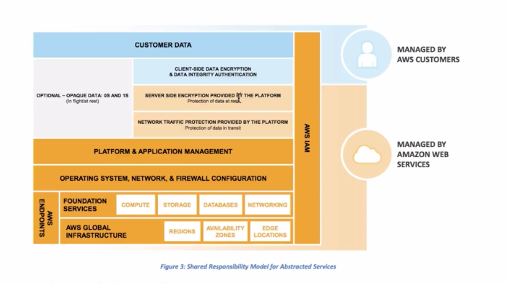

##  34. QUIZ
1. You are required to patch OS and Applications in RDS?
    * False
2. In the shared responsibility model, what is AWS's responsibility?
    * Restricting access to the data centres, proper destruction of decomissioned disks, patching of firmware for the hardware on which your AWS resources reside.

# Section 14: Route53 & DNS
##  35. L75 DNS 101

###  35.1. What is DNS?

If you've used the internet, you've used DNS. DNS is used to convert human friendly domain names (such as http://acloud.guru) into an Internet Protocol (IP) address (such as http://82.124.53.1).

IP addresses are used by computer to identify each other on the network. IP addresses commonly come in 2 different forms, IPv4 or IPv6.

###  35.2. IPv4 vs. IPv6

The IPv4 space is a 32 bit field and has over 4 billion different addresses (4,294,967,296 to be precise).

IPv6 was created to solve this depletion issue and has an address space of 128 bits which in theory is 340 undecillion addresses.

###  35.3. Top Level Domains

If we look at common domains name such as google.com, bbc.co.uk, acloud.guru etc you will notice a string of characters separated by dots (periods). The last word in a domain name represents the "top level domain". The second word in a domain name is known as a second level domain name (this is optional though and depends on the domain name).
* .com
* .edu
* .gov
* .co.uk
* .gov.uk
* .com.au

These top level domain names are controlled by the Internet Assigned Numbers Authority (IANA) in a root zone database which is essentially a database of all avaialble top level domains. You can view this database by visiting - 

###  35.4. Domain Registrars

Because all of the names in a given domain name have to be unique there needs to be a way to organize this all so that domain names aren't duplicated. This is where domain registrars come in. A registrar is an authority that can assign domain names directly under one or more top-level domains. These domains are registered with InterNIC, a service of ICANN, which enforces uniqueness of domain names across the Internet. Each domain name becomes regitered in a central database known as WhoIS database.

Popular domain registrars include GoDaddy.com, 123-reg.co.uk etc.

###  35.5. SOA Records

The SOA record stores information about;
* The name of the server that supplied the data for the zone
* The adminstrator of the zone.
* The current version of the data file.
* The number of seconds a secondary name server should wait before checking for updates.
* The number of seconds a secondary name server should wait before retrying a failed zone transfer.
* The maximum number of seconds that a secondary name server can use data before it must either be refreshed or expire.
* The default number of seconds for the time-to-live file on resource records.

###  35.6. NS Records

NS stands for Name Server records and are used by Top Level Domain servers to direct traffic to the Content DNS server which contains the authoritative DNS records.

###  35.7. A Records

An "A" record is the fundamental type of DNS record and the "A" in A record stand for "Address". The A record is used by a computer to translate the name of the domain to the IP address. For example http://www.acloud.guru might point to http:123.10.10.80.

> NB. Elastic Load Balancers always just use a DNS name.

###  35.8. TTL
The length that a DNS record is cached on either the Resolving Server or the users own local PC is equal to the value of the "Time To Live" (TTL) in seconds. The lower the time to live, the faster changes to DNS records take to propagate thoughout the internet.

> Example: User visits a new webpage, this makes a DNS call and retrieves the webpage. Now after any future visits, this webpage is now cached and no longer needs to request the DNS up until the TTL.

###  35.9. CNAMES
A Canonical Name (CName) cam be used to resolve one domain name to another. For example, you may have a movile website with the domain name http://m.acloud.guru that is used for when users browse to your domain name on their mobile devices. You may also want the name http://mobile.acloud.guru to resolve to this same address.

###  35.10. Alias Records

Alias records are used to map resource record sets in your hosted zone to Elastic Load Balancers, CloudFront distributions, or S3 buckets that are configured as websites.

Alias records work like a CNAME record in that you can map one DNS name (www.example.com) to another "target" DNS name (elb1234.elb.amazonaws.com).

Key difference - A CNAME can't be used for naked domain names (zone apex). You can't have a CNAMe for http://acloud.guru, it mut be either an A record or an Alias.

> Naked domain name: name without www.

Alias resource record sets can save you time because Amazon Route 53 automatically recognizes changes in the record sets that the alias resource record set refers to.

For example, suppose an alias resource record set for example.com points to an ELB load balancer at lb1-1234.us-east-1.elb.amazonaws.com. If the IP address of the load balancer changes, Amazon Route 53 will automatically reflect those changes in DNS answers for example.com withut any changes to the hosted zone that contains resource record sets for example.com.

###  35.11. Exam Tips
* ELB's do not have pre-defined IPv4 addresses, you resolve to them using a DNS name.
* Understand the difference between an Alias Record and a CNAME.
    * You will be charged when using CNAME, but not for Alias name
* Given the choice, always choose an Alias Record over a CNAME
    * Allows you to map naked domain name to ELB and you are not charged.

##  36. L76 Route53 - Register Your Domain Lab
N/A
##  37. L77 Setup our EC2 Instances
N/A
##  38. L78 Simple Routing Policy Lab

###  38.1. Route53 Routing Policies
* Simple
* Weighted
* Latency
* Failover
* Geolocation

###  38.2. Simple
This is the default routing policy when you create a new record set. This is most commonly used when you have a single resource that performs a given function for your domain, for example, one web server that servers content for the http://acloud.guru website.

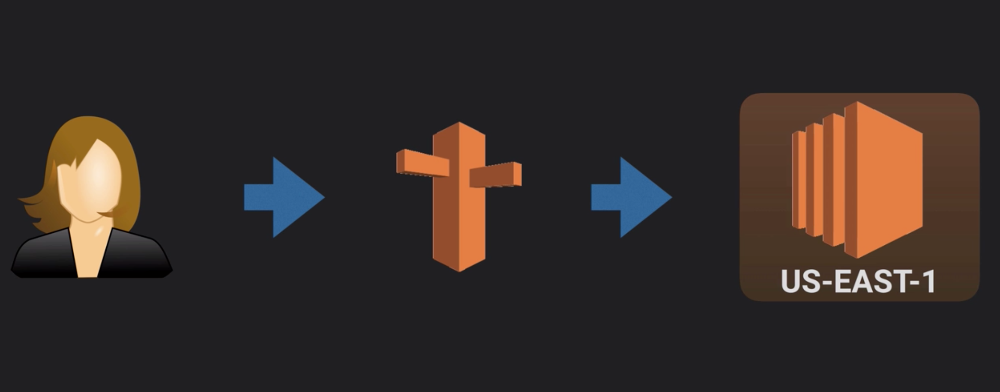
Caption: User hits DNS request which hits Route 53 and forwards that request to EC2 instances in your regions.

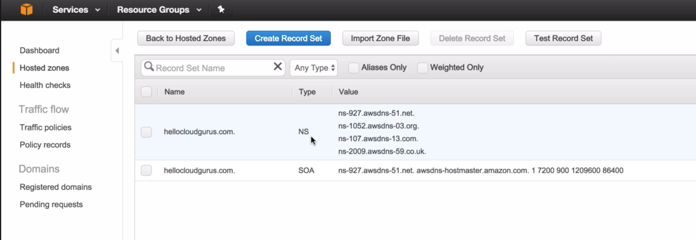
Caption: When a record set is created you always get two things by default, NS and SOA.

##  39. L79 Weighted Routing Policy Lab
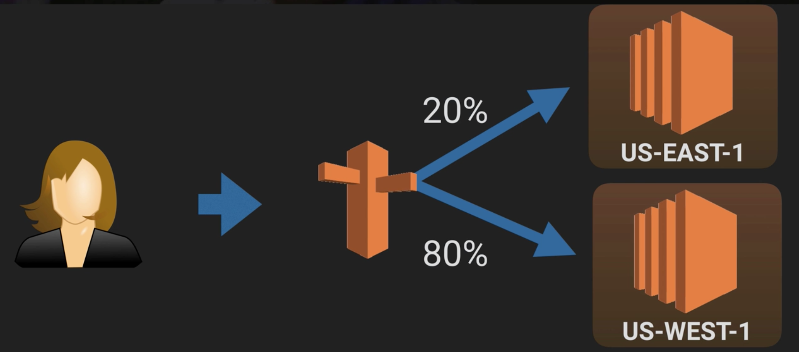

> Use cases:
>
>   1. You have a large percentage of people visiting your site from California, and a much smaller portion from Boston. So you can split the load with Weighted Routing.
>   2. You want to do some A/B testing. Note that it can be done within a single region.

###  39.1. Weighted
Weighted Routing Policies let you split your traffic based on different weights assigned.

For example you can set 10% of your traffic to go to US-EAST-1 and 90% to go to EU-WEST-1

> NB. This is cool! Seems really simple to setup.

##  40. L80 Latency Routing Policy Lab

###  40.1. Latency

Latency based routing allows you to route your traffic based on the lowest network latency for your end user (ie which region will give them the fastest response time).

To use latency-based routing you create a latency resource record set for the Amazon EC2 (or ELB) resource in eachr egion that hosts your website. WHen Amazon Route 53 receives a query for your site, it selects the latency resource record set for the region that gives the user the lowest latency. Route 53 then responds with the value associated with that resource record set.

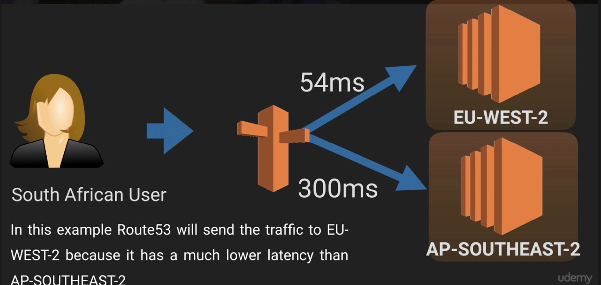

##  41. L81 Failover Routing Policy Lab

###  41.1. Failover
Failover routing policies are used when you want to create an active/passive set up. For example you may want your primary site to be in EU-WEST-2 and your secondary DR Site in AP-SOUTHEAT-2.

Route53 will monitor the health of your primary site using a health check.

A health check monitors the health of your endpoints.

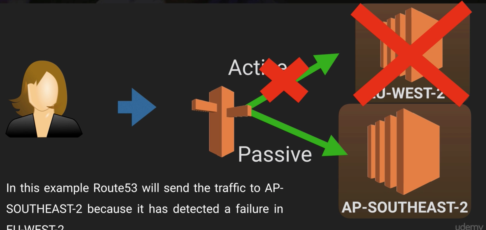

##  42. L82 Geolocation Routing Policy

###  42.1. Geolocation

Geolocation routing lets you choose where your traffic will be sent based on the geographic location of your users (ie the location from which DNS queries originate). For example, you might want all queries from Europe to be routed to a fleet of EC2 instances that are specifically configured for your European customers. These servers may have the local language of your European customers and all prices are displayed in Euros. 

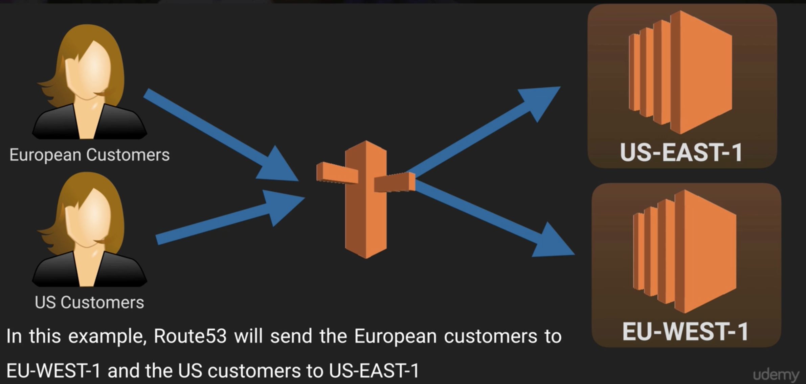

##  43. L83 DNS Summary

###  43.1. DNS Exam Tips

> NB. An ELB never has an IPv4 address, it has a DNS name. You can never have a public IP address for an ELB.

* ELB's do not have pre-defined IPv4 addresses, you resolve to them using a DNS name.
* Understand the difference between an Alias Record and a CNAME.
* Given the choice, always choose an Alias Record over a CNAME.

Remember the different routing policies and their use cases.
* Simple
* Weighted
* Latency
* Failover
* Geolocation

> NB. This information is the same for all exams.

# Section 15: Virtual Private Cloud (VPC)

##  44. L84 VPC Overview

> NB. This information is the same for all exams. Need to build out a VPC from memory, launch instances into public and private subnets and see whether or not we can ping them etc.

Think of a VPC as a logical datacenter.

###  44.1. VPC - AWS Definition
Amazon Virtual Private Cloud (Amazon VPC) lets you provision a logically isolated section of the Amazon Web Services (AWS) Cloud where you can launch AWS resources in a virtual network that you define. You have complete control over your virtual networking environment, including selection of your own IP address range, creation of subnets and configuration of route tables and network gateways.

You can easily customize the network configuration for your Amazon Virtual Private Cloud. For example, you can create a public-facing subnet for your webservers that has access to the Internet, and place your backend systems such as databases or application servers in a private-facing subnet with no Internet access. You can leverage multiple layers of security, including security groups and network access control lists, to help control access to Amazon EC2 instances in each subnet.

Additionally, you can create a Hardware Virtual Private Network (VPN) connection between your coporate datacenter and your VPC and leverage the AWS cloud as an extension of your corporate datacenter. (i.e. hybrid clouds.)

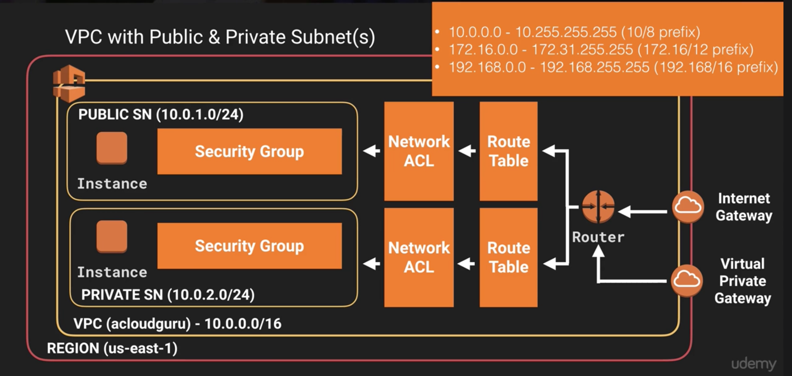
Diagram notes:
* Red line refers to the region.
* Yelow line refers to the VPC
* Network address range is a private network address.

###  44.2. Orange box in top right corner
* Almost all companies use this as internal network address
* /16 is the most common for home networking
* Maximum addressable size is /16 network.

Process Flow:
1. Gateways
    * Internet Gateway is how we conenct to the internet.
    * Virtual Private Gateway is where we terminate our VPN connections.
2. Router
    * Then it is routed depending on what we define in our route tables.
3. Network ACL
    * Goes through a Network Access Control List (second line of defense).
    * Then go through from the different ACL's the different subnets.
4. Subnets
    * Public or Private
    * Public: Internet Accessible
    * Private: Internet cannot directly access anything in our private subnets.
5. Security Groups
    * Can stretch across different subnets.
6. Instances

> NB. One subnet always equals one availability zone. Subnets cannot span multiple availability zones.

###  44.3. What can you do with a VPC?

* Launch instances into a subnet of your choosing
* Assign custom IP address ranges in each subnet
* Configure route tables between subnets
    * Route table is going to define whether a route table is public or private
* Create internet gateway and attach it to our VPC
    * Note. Only one Internet Gateway per VPC.
* Much better security control over your AWS resources
* Instance security groups
    * They are stateful. If you create a rule for HTTP in, that automatically allows HTTP to go out.
* Subnet network access control lists (ACLS)
    * They are stateless. You have to create a rule to let HTTP out even if you already have a rule for HTTP going in.

###  44.4. Default VPC vs. Custom VPC
* Default VPC is user friendly, allowing you to immediately deploy instances
* All Subnets in default VPC have a route out to the internet
    * All public. No such thing as a private subnet inside a default VPC automatically, you have to go in a create it.
* Each EC2 instance has both a public and private IP address
* If you delete the default VPC the only way to get it back is to contact AWS.

###  44.5. VPC Peering
* Allows you to connect one VPC with another via a direct network route using private IP addresses.
    * Won't go back out over the internet.
    * Could have a test VPC, dev VPC, can be all be connected together
* Instances behave as if they were on the same private network
* You can peer VPC's with other AWS accounts as well as with other VPCs in the same account
* Peering is in a star configuration, ie 1 central VPC peers with 4 others. NO TRANSITIVE PEERING!!!

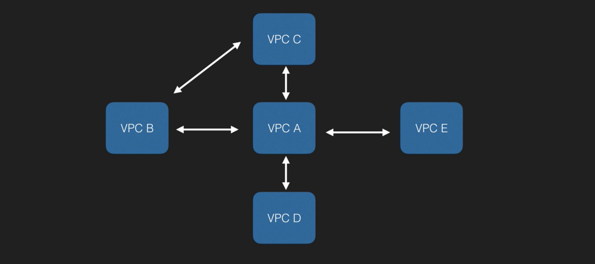

###  44.6. Exam Tips
* Think of a VPC as a logical datacenter in AWS
* Consists of IGW's (Or Virtual Private Gateways), Route Tables, Network Access Control Lists, Subnets, Security Groups
* 1 Subnet = 1 Availability Zone
* Security Groups are Stateful, Network Access Control Lists are Stateless
* NO TRANSITIVE PEERING

##  45. L85 Building Our Own Custom VPC

###  45.1. Your VPC's
CIDR: Classless InterDomain Routing. Specify what IP address ranges are. Recall there are three from the last lecture.
Tenancy: Default or Dedicated (dedicated for security reasons but more expensive)
When VPC is created:
* No subnets are created
* No Internet Gateway is created
* The main Route table is created
* A default security group is created
* A default network ACL is created

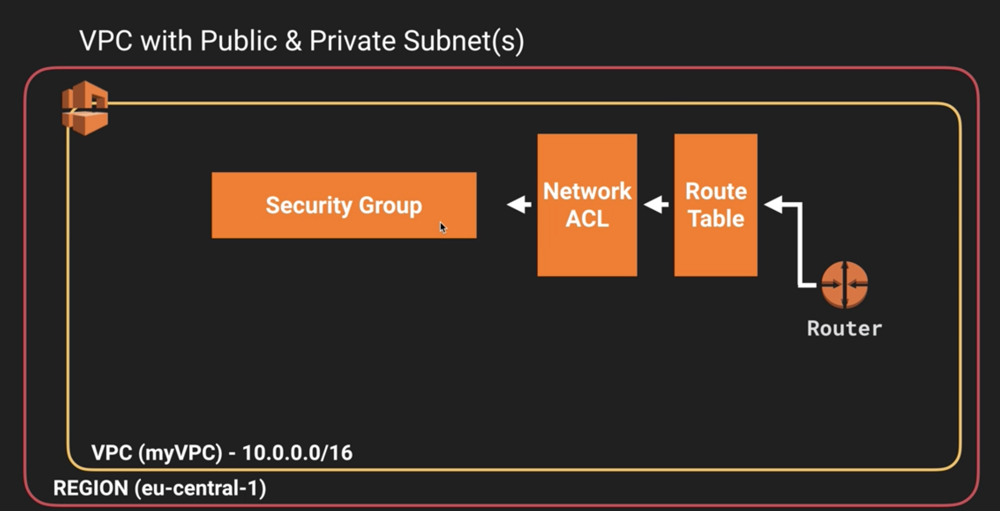
3 addresses are reserved automatically with each address. (will only come up in profressional exam)

###  45.2. Create Internet Gateway
1. Create Internet Gateway
    * By default it is dettached
2. Attach gateway to VPC

###  45.3. Create Route Table
1. Select your VPC from dropdown
2. Add route out to the internet on the non-main route.
3. Subnet Associations
    * Edit
    * Associate subnet with Route Table and give us Internet Access to any EC2 instances deployed in this subnet.
4. Go to Subnets.
    * Auto-assing Public IP addresses
    * Should be our public subnet
    1. Subnet Actions.
        * Enable auto-assign public IP
        * This means everytime we deploy an EC2 instance into this subnet, it will automatically assign a public IP address to it.

##  46. L86 Build your own custom VPC Part 2
N/A
##  47. L87 NAT Instances & NAT Gateways
* Default route table does not have a route out to the internet
* The non-default route table does have a route out to the internet

> NB. NAT instance is an EC2 instance that acts a gateway to the internet.

> NB. NAT Gateway are used in production more so than NAT instances

###  47.1. Exam Tips - NAT instances
* When creating a NAT instance, Disable Source/Destination Check on the Instance
* NAT instance must be in a public subnet
* One-to-one for subnet to availability zone
* There must be a route out of the private subnet to the NAT instance, in order for this to work. (also must have public IP address)
* The amount of traffic that NAT instances supports, depends on the instance size. If you are bottlenecking, increase the instance size.
* You can create high avaialbility using Autoscaling Groups, multiple subnets in different AZ's and a script to automate failover.
* Behind a Security GRoup.

###  47.2. Exam Tips - NAT Gateways
* Very new, may not be in the exams yet.
* Preferred by the enterprise.
* Scale automatically up to 10Gbps
* No need to patch
* Not associated with security groups
* Automatically assigned a public ip address
* Remember to update your route tables.
* No need to disable Source/Destination Checks

##  48. L88 Access Control Lists vs. Security Groups

###  48.1. Comparison
Security
* Operates at the instance level vs. Operates at the subnet level
* Supports allow rules only vs. Supports allow rules and deny rules.
* Is stateful vs. Is stateless.
* We evaluate all rules before deciding whether to allow traffic vs. We process rules in number order when deciding whether to allow traffic.
* Applies to an instance only if someone specifies the security group vs. Automatically applies to all instances in the subnets it's associated with.

> NB. One subnet goes to only one network ACL and one availbility zone.

> NB. ACL Rule numbers have numbers in increments of 100 as best practice.
###  48.2. Exam Tips - Network ACL's
* Your VPC automatically comes a default network ACL and by default it allows all outbound and inbound traffic.
* You can create a custom network ACL. By default, each custom network ACL denies all inbound and outbound traffic until you add rules.
* Each subnet in your VPC must be associated with a network ACL. If you don't explicitly associate a subnet with a network ACL, the subnet us automatically associated with the default network ACL.
* You can associate a network ACL with multiple subnets; however, a subnet can be associated with only one network ACL at a time. When you associate a network ACL with a subnet, the previous association is removed.
* A network ACL contains a numbered list of rules that is evaluated in order, starting with the lowest numbered rule.
* A network ACL has separate inbound and outbound rules, and each rule can either allow or deny traffic.
* Network ACLs are stateless; responses to allowed inbound traffic are subject to the rules for outbound traffic (and vice versa).
* Block IP Addresses using network ACL's not Security Groups (can't use security groups).

##  49. L89 Custom VPC's and ELBs
* You want at least two public (or two private) subnets as a design consideration in case one availability zone goes down

##  50. L90 NAT's vs. Bastion Servers
* Bastion is used for admin only. Access all your instances through this Bastion.

###  50.1. Exam Tips - NAT vs. Bastions
* A NAT is used to provide internet traffic to EC2 instances in private subnets.
* A Bastion is used to securely administer EC2 instances (using SSH or RDP) in private subnets. In Australia we call them jump boxes.

##  51. L91 VPC Flow Logs
> NB. This will only be seen in the Sys Exam.
Flow logs enable you to capture IP traffic flow information for the network interfaces in your resources.

##  52. L92 VPC Clean Up
N/A

##  53. L93 VPC Summary

###  53.1. Basic Exam Tips
* Think of a VPC as a logical datacenter in AWS
    * Cannot span multiple regions
* Consists of IGW's (or Virtual Private Gateways), Route Tables, Network Access Control Lists, Subnets, Security Groups
* 1 Subnet = 1 Avaiability Zone
* Security Groups are Stateful, Network Access Control Lists are Stateless
* Can Peer VPCs both in the same account and with other AWS accounts.
* NO TRANSITIVE PEERING

###  53.2. Exam Tips - NAT instances
* When creating a NAT instance, Disable Source/Destination Check on the Instance
* NAT instance must be in a public subnet
* Must have an elastic IP address to work
* There must be a route out of the private subnet to the NAT instance, in order for this to work
* The amount of traffic that NAT instances supports, depends on the instance size. If you are bottlenecking, increase the instance size.
* You can create high availability using Autoscaling Groups, multiple subnets in differente AZ's and a script to automate failover.
* Behind a Secuity Group

###  53.3. Exam Tips - NAT Gateways
* Very new, may not be in the exams yet
* Preferred by the enterprise
* Scale automatically up to 10 Gbps
* No need to patch
* Not associated with security groups
* Automatically assigned a public ip address
* Remember to update your route tables
* No need to disable Source/Destination Checks

###  53.4. Exam Tips - Network ACL's
* Your VPC automatically comes a default network ACL and by default it allows all outbound and inbound traffic.
* You can create a custom network ACL. By default, each custom network ACL denies all inbound and outbound traffic until you add rules.
* Each subnet in your VPC must be associated with a network ACL. If you don't explicitly associate a subnet with a network ACL, the subnet us automatically associated with the default network ACL.
* You can associate a network ACL with multiple subnets; however, a subnet can be associated with only one network ACL at a time. When you associate a network ACL with a subnet, the previous association is removed.
* A network ACL contains a numbered list of rules that is evaluated in order, starting with the lowest numbered rule.
* A network ACL has separate inbound and outbound rules, and each rule can either allow or deny traffic.
* Network ACLs are stateless; responses to allowed inbound traffic are subject to the rules for outbound traffic (and vice versa).
* Block IP Addresses using network ACL's not Security Groups (can't use security groups).

###  53.5. Exam Tips - NAT vs. Bastions
* A NAT is used to provide internet traffic to EC2 instances in private subnets.
* A Bastion is used to securely administer EC2 instances (using SSH or RDP) in private subnets. In Australia we call them jump boxes.

###  53.6. Exam Tips - Resilient Architecture
* If you want resilicency, always have 2 public subnets and 2 private subnets. Make sure each subnet is in different avaiability zones.
* With ELB's make sure they are in 2 public subnets in 2 different avaiability zones.
* With Bastion hosts, put them behind an autoscaling group with a minimum size of 2. Use Route53 (either round robin or using a health check) to automatically fail over.
* NAT instances are tricky to make resilient. You need 1 in each public subnet, each with their own pobulic IP address, and you need to write a scipt to fail between the two. Instead where possible, use NAT gateways.

###  53.7. Exam Tips - VPC Flow Logs
* You can monitor network traffic within your custom VPC's using VPC Flow Logs.

##  54. QUIZ
1. VPC stands for Virtual Private Cloud
    * True
2. Security groups act like a firewall at the instance level whereas ___ are an additional layer of security that act at the subnet level
    * Network ACL's
3. Select the incorrect statement:
    * In Amazon VPC, an instance retains its private IP
    * It is possible to have private subnets in VPC
    * **A subnet can be associated with multiple Access Control Lists**
    * You may only have 1 internet gateway per VPC
4. How many VPC's am I allowed in each AWS Region by default?
    * 5
5. How many internet gateways can I attach to my custom VPC
    * 1

# Section 16: The Exam

##  55. Exam Overview
* 80 minutes in length
* 55 Questions in the exam
* $ 150 USD Exam Registration Fee
* Conducted online at an approved centre
* Available in English, Japanese, Simplified Chinese, Korean, and French.

###  55.1. Register Online
* https://webassessor.com

###  55.2. Things to Note
* When taking an exam at a testing center, please arrive up to 15min early and provide the proctor with the Test Taker Authorization Code.
* You will be required to provide the Exam Proctor with 2 forms of identification (one must be a photo Government issued ID). Secondary id CC, bank debit card, employee id card.

* Exam rescheduling with less than 72 hours' notice will incur a penalty and can only be done by contacting AWS at awscertification@amazon.com

##  56. MEGA QUIZ
1. True or False - Amazon S3 buckets in all Regions provide read-after-write consistency for PUTS of new objects and eventual consistency for overwrite PUTS and DELETES.
    * True
2. In Identity Access Management, using SAML (Security Assertion Markup Language 2.0) you can give your federated users single sign-on (SSO) access to the AWS Management Console.
    * True
3. You can have 1 subnet stretched across multiple availability zones.
    * False
4. When you create new subnets within a custom VPC, by default they can communicate with each other, across availability zones.
    * True
5. It is possible to transfer a reserved instance from one Availability Zone to another.
    * True
6. You have an EC2 instance which needs to find out both its private IP address and its public IP address. To do this you need to;
    * Retrieve the instance Metadata from http://169.254.169.254/latest/meta-data/
7. To retrieve instance metadata or userdata you will need to use the following IP Address;
    * http://169.254.169.254
8. Amazon S3 buckets in all regions provide read-after-write consistency for PUTS of new objects.
    * True
9. Amazon S3 buckets in all regions do not provide eventual consistency for overwrite PUTS and DELETES.
    * False
10. Amazon S3 provides;
    * Unlimited storage
11. In order to enable encryption at rest using EC2 and Elastic Block Store you need to
    * Configure encryption when creating the EBS volume.
12. You can select a specific Availability Zone in which to place your DynamoDB Table
    * False
13. You run a website which hosts videos and you have two types of members, premium fee paying members and free members. All videos uploaded by both your premium members and free members are processed by a fleet of EC2 instances which will poll SQS as videos are uploaded. However you need to ensure that your premium fee paying members videos have a higher priority than your free members. How do you design SQS?
    * Create  two SQS queues, one for premium members and one for free members. Program your EC2 fleet to poll the premium queu first and if empty, to then poll your free members SQS queue.
14. You can have multiple SSL certificates (for multiple domain names) on a single Elastic Load Balancer.
    * True
15. What is the default region for all SDKs?
    * US-EAST-1
16. Which of the following languages is NOT supported by the AWS SDK?
    * C++
17. Which of these AWS services do not use key value pairs?
    * Route53
18. After successfully uploading a file to S3, what HTTP response code should you expect to see?
    * HTTP 200
19. What is the default encryption used on S3?
    * Advanced Encryption Standard (AES) 256
20. In the shared responsibility model, what is AWS's responsibility?
    * Restricting access to the data centers, proper destruction of decommissioned disks, patching of firmware for the hardware on which your AWS resources reside.
21. If you make an AMI public, this AMI is immediately available across all regions, by default.
    * False
22. With EC2 you can have 2 types of storage, EBS storage or Instance Store. EBS is persistent and if an EC2 instance is stopped with an EBS volume attached, there will be no data lost. Instance Store is ephemeral and if the EC2 instance is stopped, all data will be lost.
    * True
23. You are designing an application which needs to locate the public IP address on the EC2 instance on which it is stored. What do you do?
    * Get the instance's META data by visiting http://169.254.169.254/latest/meta-data/
24. How many internet gateways can I attach to my custom VPC
    * 1
25. You have 2 EC2 instances which sit in a custom VPC in a public subnet. These instances are able to receive internet traffic. You add a 3rd instance to the subnet, but it cannot access the internet. What should you do?
    * Add an elastic IP address to the new instance
26. You have added a NAT EC2 instance to your VPC, but your EC2 instances in the private subnet still cannot access the internet. What should you do with the NAT?
    * Disable source/destination checks on the NAT instance
27. You create a static hosting website in a bucket called "acloudguru" in Sydney using S3. What would the new URL End Point be?
    * http://acloudguru.s3-website-ap-southeast-2.amazonaws.com
28. You are hosting a static website in an S3 bucket which uses Java script to reference assets in another S3 bucket. For some reason however these assets are not displaying when users browse to the site. What could be the problem?
    * You haven't enabled Cross Origin Resources Sharing (CORS) on the bucket where the assets are stored.
29. There is a hard limit on how much data you can store on S3.
    * False
30. What is the largest size file you can transfer to S3 using a PUT operation?
    * 5GB
31. You have a motion sensor which writes 300 items of data every 30 seconds. Each item consists of 5kb. Your application uses eventually consistent reads. What should you set the read throughput to?
    * 10

# Section 17: What's next?
 More certifications!
